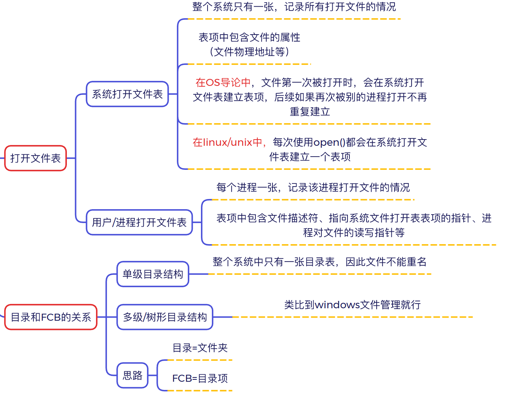
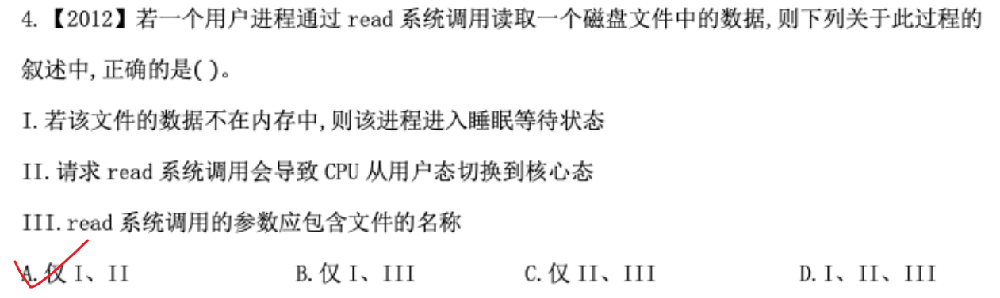
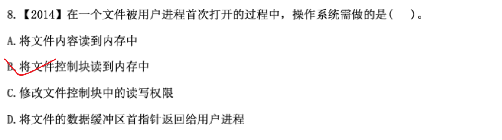
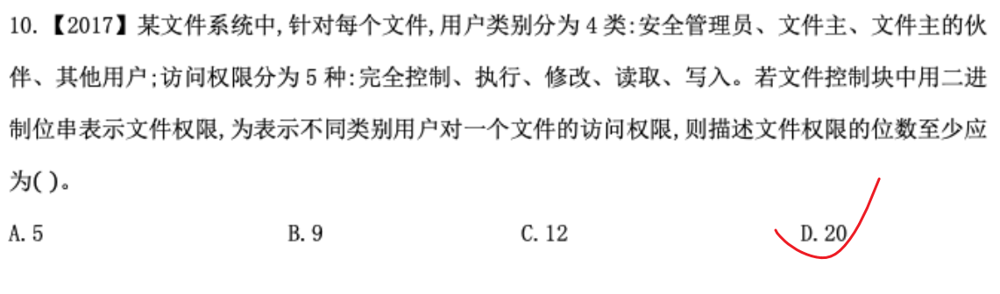
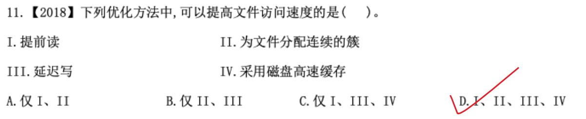
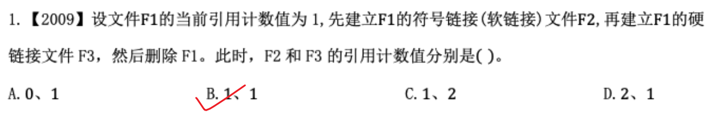
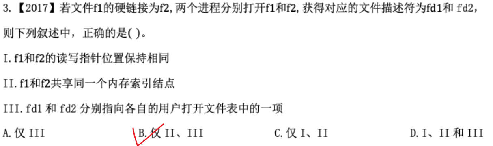
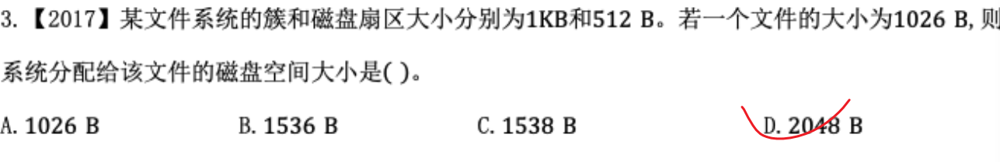

# 真题


**III. 错误**

- `read` 系统调用的原型为：`ssize_t read(int fd, void *buf, size_t count);`
    
- 它的参数包含：**文件描述符（`fd`）**、存储数据的**缓冲区指针（`buf`）**以及**读取字节数（`count`）**。
    
- **文件名**是在之前调用 `open()` 时传入的，`read()` 只需要使用 `open()` 返回的 `fd`，**不需要也不包含文件名**。


A   快速  分配在相近磁道


### 单个文件最大长度计算公式

在混合索引结构中，单个文件的最大长度由以下几个因素共同决定：

$$\text{文件最大长度} = (\text{直接地址项个数} + \text{间接地址项能指向的块数}) \times \text{文件块大小}$$

其中“间接地址项能指向的块数”取决于**间接索引的级数**（如一级、二级、三级间接）以及每个块能放多少个地址指针。

### 选项分析

- **A. 索引结点的总数（无关）**
    
    - **分析**：索引结点的总数决定的是**整个文件系统中最多能创建多少个文件**（因为一个文件对应一个 inode）。但对于**某一个具体的文件**来说，它能长到多大，跟系统中一共有多少个 inode 毫无关系。在操作系统中，**1 个索引节点（inode）严格对应 1 个文件**（或者 1 个目录，因为目录也是特殊的文件）。
        
- **B. 间接地址索引的级数（有关）**
    
    - **分析**：如果只有一级间接，能指向的数据块有限；如果有二级、三级间接，单个文件就能大得多。
        
- **C. 地址项的个数（有关）**
    
    - **分析**：inode 内部包含的直接地址项个数、间接地址项个数越多，该文件能寻址的数据块就越多，文件最大长度就越大。
        
- **D. 文件块大小（有关）**
    
    - **分析**：寻址能力是以“块”为单位的。如果寻址总块数不变，磁盘块（文件块）越大（比如从 1KB 变到 4KB），单个文件能容纳的总字节数（即文件长度）就直接翻了 4 倍。
        



### 打开文件（`open`）的本质

`open` 系统调用做的事情叫“准备工作”，也就是把文件的管理信息加载进内存，方便后续读写：

1. **查找目录**：根据路径名找到对应文件的目录项。
    
2. **加载 FCB / inode**：把保存在外存/磁盘上的 **文件控制块（FCB 或 inode）读入到内存** 的“系统打开文件表”中。
    
3. **分配句柄**：在进程的私有打开文件表中新建一项，记录当前读写指针等状态，并返回一个**文件描述符（fd）** 给用户进程。



- **单个用户的权限表示**： 访问权限共有 5 种（完全控制、执行、修改、读取、写入）。每种权限是否拥有是独立的（例如一个用户可以同时拥有“读取”和“写入”权限）。因此，需要 **5 个二进制位（bits）** 来分别控制这 5 种权限的开/关状态（位图方式）。
    
- **所有用户类别的权限表示**： 用户类别共有 4 类（安全管理员、文件主、文件主的伙伴、其他用户）。

要考虑到它是一个文件里的东西，它需要一次性的把4个用户类的权限全部说明。
并不是说在一个用户进程里表示





先逐项分析这 4 种方法的作用：

- **I. 提前读（Read-ahead）**：根据程序的局部性原理，在读取当前块时，预测性地将紧接着的后续块提前读入内存缓冲区。当进程接下来请求这些块时，可以直接从内存读取，**大幅提高了文件读取速度**。
    
- **II. 为文件分配连续的簇（Contiguous Cluster Allocation）**：将文件存放在磁盘上连续的物理块/簇中，可以显著减少磁头寻找物理块时的寻道时间和旋转延迟，从而**提高文件访问速度**。
    
- **III. 延迟写（Lazy/Delayed Write）**：当进程发出写请求时，系统先把数据写入内存缓冲区并立即返回，等积累到一定量或系统空闲时再统一写入磁盘。这减少了写磁盘的频次，使得进程不必等待慢速的磁盘 I/O 动作完成，**显著提升了文件写访问的速度**。
    
- **IV. 采用磁盘高速缓存（Disk Cache）**：利用内存中的一部分空间作为缓存，存放经常访问的磁盘块数据。后续访问命中缓存时无需启动磁盘 I/O，**极大地提升了文件访问速度**。

延迟写
### 1. 减少磁盘 I/O 次数（合并多次写操作）

如果一个程序在短时间内对同一个文件块进行了 **100 次修改**：

- **没有延迟写（同步写）**：磁头要真实地去磁盘写 100 次，每次写都要等待磁盘寻道和旋转，效率极低。
    
- **有延迟写**：数据先留在内存缓冲区，这 100 次修改全部在极快的**内存**中直接覆盖。最后等系统统一刷盘时，**实际上只对磁盘执行了 1 次真实的写操作**。

### 2. 将“随机写”变成“顺序写”

系统不会来一个写请求就刷一次盘，而是把很多进程发起的写请求在内存里“攒着”（形成脏页队列）。刷盘时，操作系统会对这些写请求按照磁盘的物理扇区位置进行**重新排序**，把原本分散在磁盘各处的“随机写”合并成一次连续的“顺序写”，大大减少了磁头来回摆动的寻道时间。

### 3. 让用户进程“零等待”（异步化）

如果不用延迟写，进程每写一次文件，CPU 就要把进程挂起（进入阻塞/睡眠状态），等慢速的磁盘物理写入完成后才唤醒进程。 使用了延迟写之后，数据写入内存缓冲区，操作系统立刻告诉进程“写完了！”，进程无需等待磁盘 I/O 就能继续往下跑，体验上的速度提升是非常巨大的。


### 选项分析

- **A. 各进程只能用“读”方式打开文件 F（错误）**
    
    - 多个进程共享一个文件时，只要权限允许，进程完全可以以“读”、“写”或“读写”方式打开，操作系统会通过互斥机制/锁来保证并发写的安全。
        
- **B. 在系统打开文件表中仅有一个表项包含 F 的属性（正确）**
    
    - 在 OS 理论（408 考研标准体系）中，**“系统打开文件表”整个系统只有一张，记录全局所有已打开文件的物理属性**。
        
    - 即使有多个进程同时打开同一个文件 F，系统打开文件表中**也只会为 F 建立一个唯一的表项**（包含物理地址等属性），并通过“共享计数/引用计数”来记录当前有多少个进程打开了它。
        
- **C. 各进程的用户打开文件表中关于 F 的表项内容相同（错误）**
    
    - 用户/进程打开文件表是**进程私有**的。
        
    - 不同的进程打开同一个文件，它们各自的**读写位置指针（offset）**、**文件描述符（fd）** 以及**打开模式（只读/只写）** 是互不干扰、各自独立的，因此表项内容**不相同**。
        
- **D. 进程关闭 F 时，系统删除 F 在系统打开文件表中的表项（错误）**
    
    - 当某一个进程关闭文件时，系统打开文件表中对应的**引用计数（共享计数）会减 1**。
        
    - **只有当引用计数减为 0**（即所有打开该文件的进程都关闭了它）时，系统才会删除该表项。
        


### 题目要求的两个指标：

1. **文件长度可变**（动态扩展文件时不需要重新搬迁整个文件）。
    
2. **随机访问**（直接根据逻辑块号 $i$ 通过下标/表项一步定位到物理块号，时间复杂度 $O(1)$）。
### 选项分析

- **A. 索引分配（索引结构）—— 正确**
    
    - **文件长度可变**：新增数据块时，只需在磁盘任意位置分配一个空闲块，并将该块物理地址写入索引表中，扩展极其容易。
        
    - **随机访问**：通过逻辑块号作为索引表的下标，可以直接查到物理块号，完美支持 $O(1)$ 随机访问。
        
- **B. 链接分配（链式结构，默认隐式链接）—— 错误**
    
    - 虽然易于动态扩展（文件长度可变），但**不支持随机访问**（只能从头节点顺着指针依次遍历访问）。
        
- **C. 连续分配（顺序分配）—— 错误**
    
    - 虽然支持随机访问，但**文件长度不易改变**（要扩展文件长度，紧接着的后面物理块可能已被占用，必须整体搬迁文件，产生碎片）。
        
- **D. 动态分区分配 —— 错误**
    
    - 这是**内存管理**中的主存分配方式（如首次适应算法等），根本不是磁盘存储空间的分配方式，属于干扰项。
        

### 总结口诀（408 高频考点）

- **连续分配**：支持随机访问，**不支持**动态扩展。
    
- **链接分配**：**不支持**随机访问，支持动态扩展。
    
- **索引分配**：**既支持**随机访问，**又支持**动态扩展。
    


- **快捷方式（符号链接/软链接）** 本质上是一个独立的文件，里面只存了源文件的路径字符串。
    
- 当操作系统内核删除源文件 `file1` 时，**并不会自动去扫描并删除系统中所有指向它的快捷方式**。
    
- 删除源文件后，原有的快捷方式依然会保留在磁盘上，只是它会变成一个无法找到目标的“无效/失效链接”（即悬空指针）。




一个文件（比如 `F1`）在同一时刻只能指向 1 个 inode！

一个文件创建时，系统生成数据块和 **inode**，并用文件名 **F1** 绑定该 inode（计数为 1）；建立硬链接 **F3** 时，是将文件名 **F3** 也绑定到**同一个 inode**（计数变 2）；它们共享相同的物理地址，删除 **F1** 只是解绑一个名字，只要计数不为 0，底层的数据和 inode 就依然存在。

### 场景二：Git 代码版本控制中的“指针”（典型的“硬链接/引用”思维）

如果你用过 Git 管理代码或项目文件：

- 在 Git 里面，如果你提交（Commit）了一个大文件，然后切了几个不同的分支，Git 并**不会在你的硬盘里复制几份这个大文件**。
    
- Git 内部维护的就是类似于 **inode 引用计数** 的机制：所有的分支指针（比如 `master`、`dev`）都指向同一个底层数据对象。
    
- 哪怕你有十个分支都在用这个文件，磁盘也只占用一份大小；只有当你删除了所有指向它的分支和提交记录，Git 的垃圾回收机制（GC）才会真正把它从磁盘抹去

### 第一步：初始状态（只有 F1）

系统为文件分配了一个物理存储区和对应的 **inode1**。目录项 `F1` 指向 `inode1`。

Plaintext

```
[ 目录项 F1 ]  ─────────► [ inode1 (计数: 1) ]  ─────────► [ 磁盘物理数据块 ]
```

### 第二步：建立软链接 F2

软链接 `F2` 是一个**全新且独立**的文件，它有自己专属的 **inode2**。`inode2` 的数据块里存的只是“路径字符串 `F1`”。

Plaintext

```
[ 目录项 F1 ]  ─────────► [ inode1 (计数: 1) ]  ─────────► [ 磁盘物理数据块 ]

[ 目录项 F2 ]  ──► [ inode2 (计数: 1) ]  ──► [ 存有"F1"路径的数据块 ]
                       │
                       └─ (访问时顺着路径找到 F1) ──► [ 目录项 F1 ]
```

> **注意**：此时 `F2` 自己有一个独立 inode（计数为 1），而 `inode1` 的计数**依然是 1**。

### 第三步：建立硬链接 F3

硬链接 `F3` 不会创建新 inode，它直接在目录里建了一个新名字，**指向同一个 inode1**。此时 `inode1` 的引用计数 **+1 变成 2**。

Plaintext

```
[ 目录项 F1 ]  ──┐
                ├───► [ inode1 (计数: 2) ]  ─────────► [ 磁盘物理数据块 ]
[ 目录项 F3 ]  ──┘

[ 目录项 F2 ]  ──► [ inode2 (计数: 1) ]  ──► [ 存有"F1"路径的数据块 ]
```

### 第四步：删除源文件 F1

删除 `F1` 就是把目录项 `F1` 划掉，同时把 `inode1` 的引用计数 **-1 变成 1**。

Plaintext

```
[ 目录项 F1 ]  x (被删掉)
                 
[ 目录项 F3 ]  ──────► [ inode1 (计数: 1) ]  ─────────► [ 磁盘物理数据块 ]

[ 目录项 F2 ]  ──► [ inode2 (计数: 1) ]  ──► [ 存有"F1"路径的数据块 ]
                       │
                       └─ (尝试去找 F1) ──► ✖ (找不到 F1，变成悬空断链!)
```

### 总结最终状态：

- **F2（软链接）的引用计数**：对应 `inode2` 的计数，结果为 **1**。
    
- **F3（硬链接）的引用计数**：对应 `inode1` 减完后的计数，结果为 **1**。
    




### 一、 为什么 I 错？（读写指针位置 **不相同**）

- **两个进程分别打开文件**：题目明确说了是“**两个进程**分别打开”。
    
- 当不同的进程去打开同一个文件（哪怕它们是硬链接关系）时，系统会在内核的**系统打开文件表**里为它们**各自创建一个独立的条目**。
    
- **读写指针（文件偏移量）是保存在“打开文件表项”里的，而不是保存在 inode 里的**。
    
- **实际效果**：进程 A 读到了文件的第 10 个字节，进程 B 刚打开文件，它的读写指针还在第 0 个字节。**两个进程的读写指针互不影响、独立变化**，所以不可能保持相同！
    

### 二、 为什么 II 对？（共享同一个内存索引节点）

- **硬链接的本质**：我们在前面聊过，`f1` 和 `f2` 是硬链接关系，它们指向磁盘上**同一个物理 inode**。
    
- 当文件被打开时，操作系统会把磁盘上的 inode 加载到内存中，形成一个**内存索引节点（Active Inode）**。
    
- 因为它们本质上是同一个文件，所以系统在内存里**只会维护一份**这个文件的 inode，`f1` 和 `f2` 共享它。所以 II 是绝对正确的。
    

### 三、 为什么 III 对？（fd1 和 fd2 分别指向各自的用户打开文件表中的一项）

- **文件描述符（fd）的本质**：`fd`（比如 3、4、5 这种数字）只是一个**数组下标**。
    
- **用户打开文件表（Process Open File Table）**：每个进程内部都有自己专属的一张表（记录这个进程打开了哪些文件）。
    
- **对应关系**：
    
    - 进程 1 的 `fd1` 指向 **进程 1 自己的用户打开文件表** 中的某一项。
        
    - 进程 2 的 `fd2` 指向 **进程 2 自己的用户打开文件表** 中的某一项。
        
- 两个进程拥有各自独立的进程空间和用户打开文件表，所以 `fd1` 和 `fd2` 必然是分别指向各自表中的一项。III 是完全正确的。
    

### 结构调用关系图（秒懂核心）

Plaintext


### 总结归纳

- **共享的是**：内存索引节点（内存 inode） $\rightarrow$ **对应 II**
    
- **独立的是**：用户打开文件表（`fd` 所在表）、系统打开文件表项（读写指针所在位置） $\rightarrow$ **对应 III 和 I**
    

所以 II 和 III 正确，选 **B**！



- 在文件系统中，**文件空间分配的基本单位是“簇”（Cluster）**，而不是“扇区（Sector）”。
    
- 扇区是硬件（磁盘物理层）的读写单位，而操作系统进行磁盘空间管理和分配时，一律以**簇**为最小单位。

|**对比维度**|**磁盘扇区（Sector）**|**磁盘簇（Cluster / 盘块）**|
|---|---|---|
|**存在层级**|**硬件层 / 物理层**|**操作系统层 / 逻辑层**|
|**谁来定义？**|由**磁盘厂商**出厂时格式化好（比如固态硬盘/机械硬盘）|由**操作系统**在格式化分区（如 NTFS、FAT32）时定义|
|**常见大小**|传统为 **512 B**，现代 Advanced Format 为 **4 KB**|常见为 **4 KB**（通常由 8 个 512B 扇区组成，可以灵活调整）|
|**作用**|磁盘驱动器进行**物理读写**的最小磁道划分|操作系统给文件**分配磁盘空间**的最小单位|
### 二、 扇区是在什么时候使用的？

既然操作系统都是按“簇”来存文件的，那扇区到底是给谁用的？主要在以下 **3 个底层场景** 会用到扇区：

#### 1. 硬件驱动层进行数据传输时（I/O 操作）

当你让系统读取一个 $4\text{ KB}$ 的簇时：

- 操作系统把指令发给**磁盘驱动程序**。
    
- 驱动程序把这个“簇”翻译成物理地址：“去读取第 5 柱面、2 磁头、第 10 到 17 号**扇区**”。
    
- 磁盘硬件按**扇区**为单位，把数据从盘片/闪存颗粒上读入硬件缓冲区，再送给 CPU。
    

#### 2. 磁头定位与寻道（物理定位）

机械硬盘的磁头在高速旋转时，需要精准知道自己停在盘片的哪一条磁道、哪个位置。**扇区就是盘片上的物理坐标**，硬件控制芯片（Firmware）靠读取扇区头部的物理标记来确保没有读偏。

#### 3. 磁盘检测与坏道修复（低级维护）

- 当电脑提示“磁盘存在坏道（Bad Sector）”时，指的就是**物理扇区损坏**了。
    
- 磁盘内部的控制器（S.M.A.R.T 系统）检测到某个扇区损坏后，会自动把这个扇区屏蔽掉，并用备用扇区替换它（扇区重映射）。
    

### 三、 为什么操作系统不直接按“扇区”来分配空间？

你可能会想，扇区更小（比如 512 B），直接按扇区分配，前面题目里那个 $1026\text{ B}$ 的文件不就只需要 3 个扇区（$1536\text{ B}$），能省下不少空间吗？

操作系统选择“簇（如 4 KB）”主要有两个原因：

1. **减少管理开销（位图/FAT 表不会爆）**
    
    - 假设 $10\text{ GB}$ 磁盘：
        
        - 如果按 **512 B 扇区** 管理，共有 2000 万个块，系统要用极大的索引表（位图）来记哪个扇区空着，极其吃内存。
            
        - 如果按 **4 KB 簇** 管理，块的数量直接减少到 1/8，管理表格大大缩小，查询速度翻倍！
            
2. **提升读写吞吐量（减少寻道次数）**
    
    - 现在的很多大文件（如视频、游戏）都是几 GB。如果按 512 B 慢慢分配，磁盘要频繁寻道几百万次；打包成 4 KB 甚至更大的簇，一次性连续读写，效率高得多。


Here's my take: **磁盘硬件在物理上依然是以“扇区”为单位读取的，但操作系统在向磁盘发指令时，通常是以“簇”为单位进行请求的！**

这中间存在一个 **操作系统（软件层）** 和 **磁盘控制器（硬件层）** 的配合机制，我们可以分两种情况来看：

### 1. 绝大多数情况（常规文件读取）：按“簇”整块读入内存

当你编写代码去读取一个文件里的仅仅 1 个字节（`1 Byte`）时：

- **操作系统**并不会只向磁盘请求 1 个字节，而是直接要求磁盘读取该数据所在的 **整个簇（比如 4 KB）**。
    
- **磁盘控制器**接收到指令后，连续把这个簇对应的 **8 个扇区（假设每个扇区 512 B）** 全部读入系统内存。
    
- **为什么要这么做？（局部性原理）**
    
    - 因为磁盘最慢的操作是“寻道”（磁头找位置）。既然磁头已经对准了这个位置，一口气把附近的 8 个扇区全部读出来，成本和只读 1 个扇区几乎没区别。
        
    - 操作系统赌你接下来大概率会读取紧挨着的后续数据（空间局部性），所以先把它所在的整个簇全拿进**内核缓冲区（Page Cache）**。
        

### 2. 特殊底层情况：直接读取单个“扇区”

磁盘硬件本身**绝对支持**只读取单个扇区。在某些特定的底层场景下，系统确实只读一个扇区：

- **读取 MBR / GPT 引导扇区**：电脑开机时，BIOS/UEFI 只读取磁盘的第 0 号物理扇区（512 B）来加载引导程序，此时系统甚至还没加载文件系统（簇的概念还没生效）。
    
- **直接裸盘读写（Raw I/O / Direct I/O）**：比如高性能数据库（如 Oracle、MySQL）或磁盘修复工具，绕过了操作系统的文件系统和缓存，直接向磁盘驱动发指令：“给我把第 X 号扇区的内容读出来”。此时硬件就只读取那 **1 个扇区**。
    

### 总结（一句话厘清）

- **硬件能力**：磁盘硬件最高精度的读写单位是 **扇区**（可以只读 1 个扇区）。
    
- **系统策略**：为了整体性能，操作系统做文件读写时，总是以 **簇** 为最小单位打包读取到内存里。


为什么不干脆直接按照簇来划分呢?
### 1. 物理制造与控制的限制（盘片不是无限精密的）

机械硬盘的盘片是高速旋转的（比如 7200 转/分），磁头悬浮在微米级的高度上读取磁性颗粒。

- **校验与定位**：磁头在盘片上高速移动时，必须频繁地通过**物理标记**来确认“我现在在哪”以及“数据有没有读错”。
    
- 每个扇区头尾都有独立的物理信号（如 ECC 错误校验码、磁道标志）。
    
- 如果把物理块做成 $4\text{ KB}$ 甚至更大（直接用“簇”的物理尺寸）：一旦盘片表面出现一点点极其微小的物理划痕或瑕疵，**损失的校验区域和数据范围就会呈指数级放大**，磁盘的良品率和容错能力会暴跌。
    

### 2. 硬件必须兼容不同的操作系统和文件系统

磁盘厂商生产一块硬盘，它不知道买家是要装 Windows（NTFS/FAT32）、Mac（APFS）、Linux（EXT4）还是跑嵌入式系统（如路由器）。

- **不同的操作系统对“簇”的大小需求截然不同**：
    
    - 搞视频剪辑的系统，可能希望簇是 $64\text{ KB}$ 甚至更巨大，以提高大文件吞吐量；
        
    - 搞大量小文本处理或代码编译的系统，可能希望簇是 $1\text{ KB}$ 或 $2\text{ KB}$，以减少空间浪费（尾部碎片）。
        
- 如果磁盘在出厂时就把物理硬件锁死成某个固定的“簇”大小，那它的**通用性就彻底废了**。操作系统通过将物理“扇区”组合成逻辑“簇”，获得了极高的自由度。
    

### 3. 数据写入的“原子性”与断电保护（关键安全问题）

在磁盘底层，物理写入必须是“要么成功，要么失败”的不可分割单元（即原子操作）。

- 磁盘内部的电容在突然断电时，储备的电能只够磁头安全完成一个微小物理块（扇区）的写入操作。
    
- 如果物理写入单位过大（比如直接按 $4\text{ KB}$ 或更大的“簇”物理写入），一旦在写入中途 अचानक 掉电，这整个大块数据就会处于“半写不写”的损坏状态，极易导致整个文件系统崩溃。
    

### 4. 事实上，硬件已经在向“大扇区”演进（高级格式化 AF）

其实你的直觉非常敏锐！硬件厂商也早就发现了 512 字节扇区太小、校验开销太大的问题。

因此，现在的现代硬盘（包括 SSD 和现代机械硬盘）普遍采用了 **高级格式化（Advanced Format, AF）**，将**物理扇区大小从 512 B 提升到了 4 KB**。

**但为什么大家还是管它叫“扇区”而不是“簇”呢？**

- 因为即便物理扇区变成了 $4\text{ KB}$，为了兼容老系统，磁盘控制器依然会在硬件内部做一层“512 B 扇区仿真（512e）”。
    
- **层级划分依然清晰**：**扇区**永远代表硬件能够进行物理原子读写的最小边界；而**簇**永远代表操作系统进行逻辑分配和管理的文件块。两者分工明确，绝不混淆。


