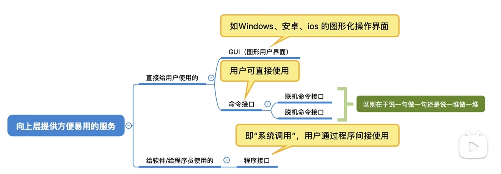
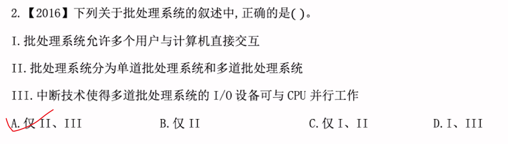
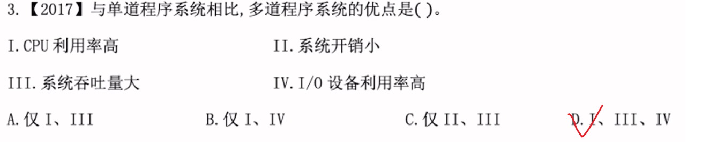
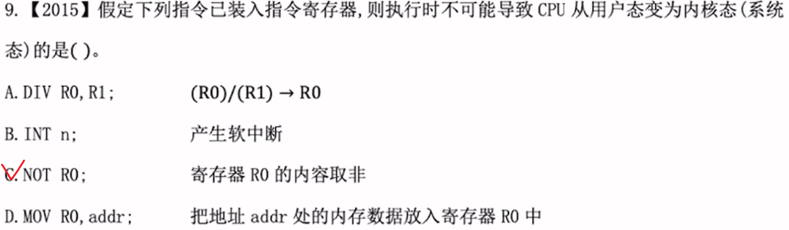
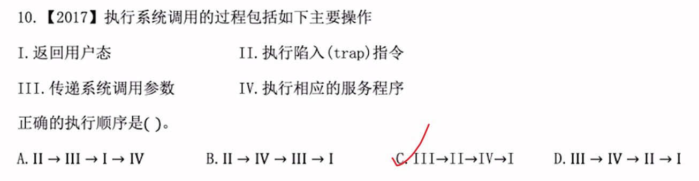
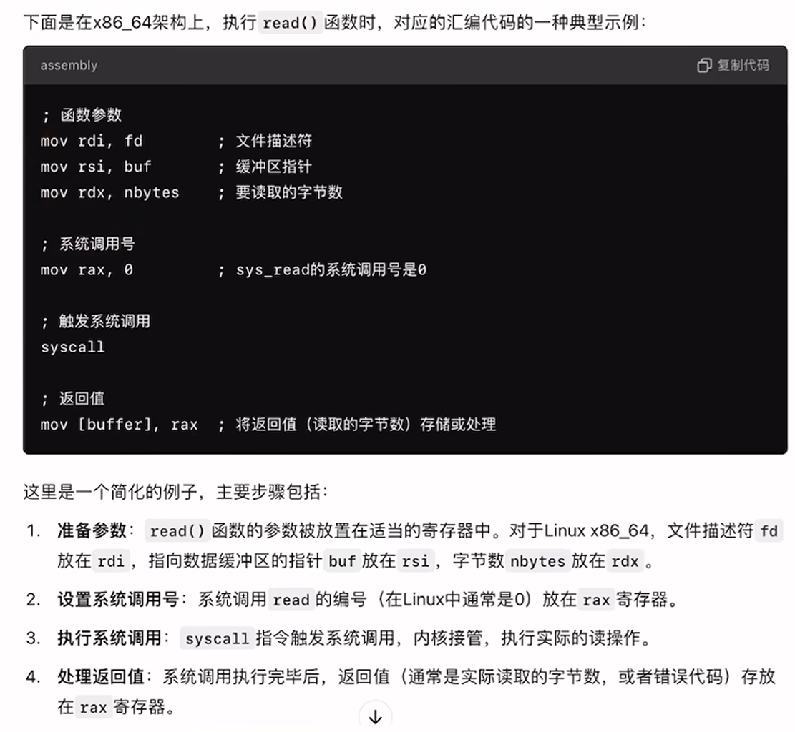
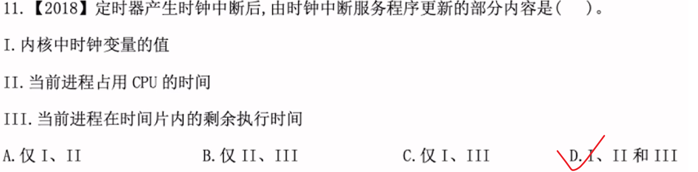
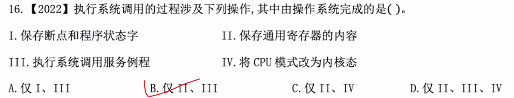
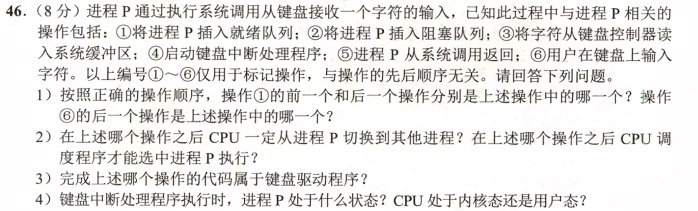

# os内核


### 进程虚拟地址空间示意图（高地址 $\rightarrow$ 低地址）

Plaintext

```
+---------------------------------------------------+  高地址 (如 0xFFFFFFFF / 32位系统)
|                   内核空间 (Kernel Space)          |  ← 操作系统内核驻留区，用户态禁止直接访问
+---------------------------------------------------+  (用户态/内核态划分界限)
|                命令行参数 与 环境变量               |  ← 存放 main(int argc, char *argv[]) 等参数
+---------------------------------------------------+
|                     栈 (Stack)                    |  ↓ 【向低地址增长】
|                         ↓                         |  ← 局部变量、函数调用栈帧、返回地址
|                                                   |
|                                                   |  (未分配的动态缓冲区/共享映射区)
|                                                   |
|                         ↑                         |
|                     堆 (Heap)                     |  ↑ 【向高地址增长】
|                                                   |  ← 动态分配的内存（malloc / new）
+---------------------------------------------------+
|                BSS 段 (Uninitialized)             |  ← 未初始化的全局变量、静态变量 (默认清零)
+---------------------------------------------------+
|               数据段 (Data Segment)               |  ← 已初始化的全局变量、静态变量
+---------------------------------------------------+
|               代码段 (Text Segment)               |  ← CPU 执行的机器指令、只读常量（只读）
+---------------------------------------------------+  低地址 (0x00000000)
```

### 408 高频考点解析

|**区域名称**|**存储内容**|**增长方向 / 特性**|**408 常见考查方式**|
|---|---|---|---|
|**内核空间**|操作系统内核代码、数据结构|-|考查**用户态与内核态转换**、中断/系统调用时的切态过程。|
|**栈 (Stack)**|函数局部变量、函数参数、返回地址|**向低地址增长** (从上往下)|考查**栈溢出 (Stack Overflow)**（如递归调用层次过深）、函数调用栈帧变化。|
|**堆 (Heap)**|动态申请的内存（如 `malloc`、`new`）|**向高地址增长** (从下往上)|考查堆与栈的**增长方向相反**；内存动态分配与回收。|
|**BSS 段**|未初始化的全局变量和静态变量 (`static`)|固定大小|考查 BSS 段在目标程序中不占用实际可执行文件磁盘空间，运行时由 OS 清零。|
|**数据段 (Data)**|已初始化的全局变量和静态变量 (`static`)|固定大小|区分全局/静态变量与局部变量的存放位置。|
|**代码段 (Text)**|CPU 执行的机器指令、只读文本/字符串|只读 (Read-Only)|防止程序运行中意外修改指令；多个进程可共享同一个代码段。|

### 快速记忆口诀

- **头顶内核与参数**：最顶上是内核空间与环境变量。
    
- **双向奔赴栈和堆**：**栈在上向下长**，**堆在下向上长**，中间留空做缓冲。
    
- **全局静态分初始化**：已初始化存 **Data**，未初始化存 **BSS**。
    
- **只读代码在脚底**：最低地址放 CPU 执行的**只读指令**。


# os引导


### 1. 磁盘分区结构（以经典 MBR 结构为例）

从磁盘的**低地址到高地址**（第 0 块扇区开始），磁盘划分如下：

Plaintext

```
+-------------------------------------------------------------------------------+
| 主引导记录 (MBR)  |  分区表 (DPT)  |  活动分区 (Active Partition) | 普通分区  |
| (Sector 0, 512B) | (MBR 的一部分) | (如 C 盘: 引导扇区 + 内核)  | (如 D/E)  |
+-------------------------------------------------------------------------------+
```

- **主引导记录 (MBR - Master Boot Record)：** 位于磁盘的 **第 0 块扇区**（Sector 0，大小为 512 字节），是计算机开机后访问磁盘的第一个地方。
    
    - **主引导程序 (Boot Loader 第1阶段)：** 占前 446 字节，负责查找哪个分区是“活动分区”。
        
    - **分区表 (DPT - Disk Partition Table)：** 占 64 字节，记录磁盘分成了几个区、各区的起始位置。
        
    - **结束标志：** 占 2 字节（`0x55AA`）。
        
- **活动分区 (Active / Boot Partition)：** 标记为“可引导”的分区（通常是 C 盘）。
    
    - **分区引导扇区 (PBR / VBR)：** 该分区的第 0 个扇区，存放**引导逻辑**。
        
    - **操作系统内核 (OS Kernel)：** 存放操作系统真 正代码的文件（如 `vmlinuz` 或 `NTLDR / bootmgr`）。
    - **操作系统初始化程序**
        

### 2. 内存映像视角：操作系统引导的 5 个步骤

开机时，内存空间是没有内核的。系统通过“接力赛”的方式，一步步把内核从磁盘拉进内存：

Plaintext

```
+-------------------------------------------------------------------------------+
|  1. ROM (固件)   -->   2. MBR (磁盘0扇区)  -->  3. PBR (活动分区首扇区)          |
|  (运行 BIOS)          (读取磁盘分区表)          (加载特定系统的 Boot Loader)  |
+-------------------------------------------------------------------------------+
                                                         |
                                                         v
                                              4. 加载 OS 内核到内存
                                                         |
                                                         v
                                              5. 初始化并进入用户态
```

### 408 考研高频对比与常考点

| **阶段**            | **运行的代码在哪里？**    | **被加载到内存的什么地方？**       | **408 考查重点 / 核心职责**                       |
| ----------------- | ---------------- | ---------------------- | ----------------------------------------- |
| **① BIOS / UEFI** | 固化在主板的 **ROM** 中 | 开机直接执行（CPU 硬件跳转）       | 进行硬件**自检 (POST)**；按 Boot 顺序读取磁盘 Sector 0。 |
| **② MBR**         | 磁盘 **Sector 0**  | **RAM** (通常是 `0x7C00`) | 检查分区表，找到**活动分区 (Active Partition)** 的位置。  |
| **③ PBR (分区引导)**  | 活动分区的首扇区         | **RAM**                | 识别该分区的文件系统，定位 OS 引导程序。                    |
| **④ Boot Loader** | 活动分区的磁盘文件        | **RAM**                | 彻底将 **OS 内核** 从磁盘读取并解压到内存中。               |
| **⑤ Kernel Init** | 已在 RAM 中的内核代码    | **RAM (内核空间)**         | 初始化 CPU/内存/驱动，创建 `init` 进程，切到**用户态**。     |
|                   |                  |                        |                                           |
|                   |                  |                        |                                           |

### 💡 记忆小结（考研切入点）

- **硬件层（ROM）：** 只有 **BIOS / 固件** 在 ROM 中，其他所有引导程序和内核都在磁盘上。
    
- **第 0 扇区（MBR）：** 不属于任何具体文件系统或分区，是全盘的入口。
    
- **活动分区（PBR）：** 属于具体分区，是操作系统的入口。
    
- **接力顺序：** `BIOS (ROM) → MBR (磁盘) → PBR (分区) → 内核 (加载至 RAM)`。


| **接口分类**    | **主要面向对象**     | **使用方式 / 工具**             | **运行状态 / 权限**        | **典型例子**                      |
| ----------- | -------------- | ------------------------- | -------------------- | ----------------------------- |
| **命令接口**    | 普通终端用户         | 键盘输入命令 / 鼠标点击             | 用户态                  | 命令行 (CLI)、图形界面 (GUI)、Shell 脚本 |
| **程序接口**    | 软件程序员 / 应用程序   | 库函数（如 C 的 `fopen`）、直接系统调用 | 从用户态陷入**内核态**        | 系统调用（System Call）、API         |
| **低级/硬件接口** | 驱动开发者 / 操作系统本身 | 汇编指令、硬件中断                 | 核心态/内核态（Kernel Mode） | 特权指令、CPU 中断处理、硬件驱动            |




# 真题

---


#### 1. 没有中断技术时（早期/单道批处理）：

- CPU 启动 I/O 设备后，必须通过忙等（Polling，轮询）的方式不断检查 I/O 是否完成。
    
- 在此期间，CPU 不能做任何别的事情，CPU 与 I/O 只能**串行**（CPU 被死死卡住）。
    

#### 2. 引入中断技术后（多道批处理系统）：

- **CPU 启动 I/O 设备：** CPU 向 I/O 控制器发出指令后，**立即切换去执行其他进程**（不等待）。
    
- **设备并行工作：** I/O 设备在独立传输数据的同时，CPU 在高效率地运行其他程序，**两者实现了真正的并行**。
    
- **通知 CPU：** 当 I/O 设备传输完成后，硬件会向 CPU 发送一个**中断信号**。CPU 收到中断后再暂停当前工作，转去处理 I/O 完成后的后续工作（如读取缓冲区）。


|**I/O 控制方式**|**设备准备数据时，CPU 在干嘛？**|**数据传输（接口 → 内存）时，谁来搬数据？**|**CPU 与 I/O 的并行度**|
|---|---|---|---|
|**程序直接控制 (轮询)**|只能一直死等（忙等）|**CPU** 搬运|**完全无法并行**（串行）|
|**中断驱动方式**|去跑其他程序（**并行**）|**CPU** 搬运（正如你所说的阶段 2）|**部分并行**（准备数据时并行，传输时 CPU 仍需参与）|
|**DMA 方式 (直接存储器存取)**|去跑其他程序（**并行**）|**DMA 控制器** 直接搬到内存，**CPU 彻底解放**|**几乎完全并行**（CPU 只在开头启动DMA和结尾处理中断时介入）|


---



- **I. CPU 利用率高（正确）：**
    
    单道程序在进行 I/O 操作时，CPU 必须空闲等待；而多道程序系统中，当某个程序等待 I/O 时，操作系统可以立即调度另一个程序让 CPU 继续计算，极大减少了 CPU 的闲置时间。
    
- **II. 系统开销小（错误 ❌）：**
    
    **多道程序系统的系统开销反而更大**。因为为了实现多道程序的并发运行，操作系统必须引入进程管理、并发控制、内存保护、中断处理、上下文切换（Context Switch）等复杂的机制，这些都会带来额外的系统时间与空间开销。相比之下，单道程序系统结构简单，开销极小。
    
- **IV. I/O 设备利用率高（正确）：**
    
    多道程序允许多个进程并发申请和使用不同的 I/O 设备（例如进程 A 在用磁盘，进程 B 在用打印机），使各种外设尽量处于忙碌状态，从而提升了 I/O 设备的利用率。


---



**D. `MOV R0, addr;`（内存访存指令）**

- 该指令需要访问内存地址 `addr` 处的数据。
    
- 如果在虚拟内存机制下，`addr` 对应的页面**不在物理内存中**（触发缺页异常），或者存在**越界/权限违规**（如越权访问内核地址，触发段错误），CPU 就会捕获此异常并**切换到内核态**进行处理（如调页或终止进程）。因此**可能**导致切换。


---



---




---



### 详细解析

时钟中断（Clock Interrupt）是操作系统中最基础、最频繁发生的中断之一（也叫脉冲/滴答中断），它的核心作用就是**维持系统的时钟运作**和**管理进程的时间 slice（时间片）**。

### 📊 总结对比（一表看清）

| **概念**               | **比喻**     | **特点**        | **目的**                   |
| -------------------- | ---------- | ------------- | ------------------------ |
| **Ⅰ. 内核时钟变量**        | **墙上的挂钟**  | /             | （系统时间等）                  |
| **Ⅱ. 当前进程占用 CPU 时间** | **累加的总时长** | **只增不减**（累加）  | 统计这个进程**一共**耗费了多少 CPU 资源 |
| **Ⅲ. 时间片剩余时间**       | **上课的倒计时** | **只减不增**（倒计时） | 用来判断**现在需不需要换别的进程上 CPU** |

### 💡 考研记忆卡片：时钟中断四大职责

1. **维持系统时钟**（更新全局时间变量）
    
2. **进程时间片计数**（倒计时，决定是否触发调度）
    
3. **统计进程 CPU 使用率**（更新进程运行时间）
    
4. **处理定时任务**（如软定时器、超时重传等）


---



| **保存内容**               | **保存者（执行主体）**       | **为什么由它保存？**                                                                             |
| ---------------------- | ------------------- | ---------------------------------------------------------------------------------------- |
| **PC（断点）与 PSW（程序状态字）** | **硬件（CPU 中断隐指令）**   | **还没来得及运行软件代码！** 在硬件切换状态的瞬间，CPU 必须立刻把“下一步执行哪”和“当前状态”强制存起来，否则接下来跳转到中断服务程序时，旧的 PC/PSW 就丢了。 |
| **通用寄存器（如 R0~R15）**    | **操作系统（中断服务程序/软件）** | CPU 硬件为了追求极致的速度，只保存最核心的 PC/PSW。剩下的通用寄存器，由操作系统内核里的汇编代码写 `PUSH` 指令压栈保存。                    |

### III. 执行系统调用服务例程（操作系统完成）

- **什么是服务例程？**
    
    - 就是操作系统内核里具体干活的 C 语言/汇编函数（比如 `sys_read` 负责读文件、`sys_fork` 负责创建进程、`sys_malloc` 负责分配内存）。
        
- **为什么是操作系统完成？**
    
    - CPU 硬件本身只懂简单的加减乘除、跳转等基础指令，它根本不知道“文件系统怎么读”、“内存页表怎么分配”。
        
    - 具体的业务逻辑**完全是由操作系统（Kernel）软件编写的代码**来实现的。所以 CPU 只是在“执行操作系统写好的代码”。
        

### IV. 将 CPU 模式改为内核态（硬件完成）

        
- **为什么必须由硬件完成？**
    
    - **权限逻辑冲突**：如果让“软件”去修改 CPU 状态，那用户态的代码岂不是随时可以通过写一句代码把自己变成“内核态”？这样系统的安全性就彻底崩溃了。
        
    - **硬件级强制转换**：当 CPU 执行到陷入指令（如 `syscall` 或 `int n`）时，**CPU 芯片内部的硬件电路**会立刻识别到这个特权信号，自动将 CPU 内部的状态寄存器（如 CR0/EFLAGS 中的标志位）切换为内核态（Ring 0）。
        
    - 也就是说，**从用户态（Ring 3）跨越到内核态（Ring 0）的那一瞬间，是硬件电路拉闸切过来的**，软件本身没有权限改变自己的运行模式。
        
### 💡 综合流程小串联

当你调用 `read()` 读文件时，底层发生的顺序是：

1. **用户程序**：把参数备好，执行 `syscall` 指令。
    
2. **CPU 硬件（自动完成）**：
    
    - 把 CPU 运行模式**改成内核态**（对应 **IV**）。
        
    - **保存 PC 和 PSW**（对应 **I**）。
        
    - 跳转到内核入口地址。
        
3. **操作系统内核（软件接管）**：
    
    - 用 `push` 指令**保存通用寄存器**（对应 **II**）。
        
    - 根据系统调用号，**执行对应的服务例程**（如 `sys_read`，对应 **III**）。
        
    - 干完活后恢复现场，返回用户态。


---




### 整体全流程梳理

1. **进程 P 执行系统调用**：进程 P 发起读键盘请求，由于此时键盘还没有输入数据（系统缓冲区，发现是空的），进程 P 必须等待。
    
2. **② 将进程 P 插入阻塞队列**：操作系统将进程 P 从运行态变为阻塞态（等待键盘输入），CPU 切换去执行其他进程。
    
3. **⑥ 用户在键盘上输入字符**：用户按下按键，键盘控制器触发硬件中断。
    
4. **④ 启动键盘中断处理程序**：CPU 响应外设（键盘）中断，暂停当前进程，进入键盘中断处理程序（内核态）。
    
5. **③ 将字符从键盘控制器读入系统缓冲区**：键盘驱动程序执行，把字符从硬件读出来暂存到系统的内核缓冲区。
    
6. **① 将进程 P 插入就绪队列**：既然数据已经读到了，内核将进程 P 唤醒（从阻塞态变为就绪态）。
    
7. **⑤ 进程 P 从系统调用返回**：CPU 重新调度选中进程 P，将缓冲区中的字符交给 P，P 恢复运行并返回用户态。
    

> **完整的事件链为**：**② $\rightarrow$ ⑥ $\rightarrow$ ④ $\rightarrow$ ③ $\rightarrow$ ① $\rightarrow$ ⑤**

### 各小问标准答案与解析

#### 1）问题 1

- **操作 ① 的前一个操作是**：**③** （将字符从键盘控制器读入系统缓冲区）
    
- **操作 ① 的后一个操作是**：**⑤** （进程 P 从系统调用返回）
    
- **操作 ⑥ 的后一个操作是**：**④** （启动键盘中断处理程序）

#### 2）问题 2

- **CPU 一定从进程 P 切换到其他进程的操作**：**②** （将进程 P 插入阻塞队列）之后
    
- **CPU 调度程序才能选中进程 P 执行的操作**：**①** （将进程 P 插入就绪队列）之后

#### 3）问题 3

- **代码属于键盘驱动程序的操作**：**③** （将字符从键盘控制器读入系统缓冲区）
    

> **解析**：驱动程序（Driver）是操作系统用于**直接与硬件设备交互/控制硬件**的底层代码。负责直接从键盘控制器/寄存器中读取原始数据并写入内核缓冲区的，正是键盘驱动程序。

#### 4）问题 4

- **进程 P 处于的状态**：**阻塞态（或 Waiting / Blocked 状态）**
    
- **CPU 处于的状态**：**内核态（系统态）**


| **阶段**      | **触发原因**                     | **执行的代码**                  | **进程 P 的状态**                          |
| ----------- | ---------------------------- | -------------------------- | ------------------------------------- |
| **P 请求读键盘** | 软件主动请求 (System Call)         | **系统调用服务程序**（如 `sys_read`） | 运行态 $\rightarrow$ **阻塞态**             |
| **用户按下键盘**  | 硬件外设发信号 (Hardware Interrupt) | **键盘中断处理程序**（驱动代码）         | 保持在**阻塞态** $\rightarrow$ 被唤醒变为**就绪态** |


# 总结

## 考点一：操作系统的基本特征（高频选择题）

这部分几乎每年必考选择题，核心就是区分 **并发** 和 **并行**，以及理解 **共享**。

### 1. 并发（Concurrency） vs 并行（Parallelism）

- **并发**：指多个事件在**同一时间段**内发生。在**单 CPU** 上，通过 CPU 快速切换（分时）实现，**宏观上同时，微观上交替执行**。
    
- **并行**：指多个事件在**同一时刻**发生。必须依赖**多核 CPU / 多个物理 CPU**，**宏观和微观上都是同时执行**。
    

> **考研真题坑点**：单核 CPU 能实现“并发”，但无法实现“并行”。

### 2. 共享（Sharing）

- **互斥共享**：同一时间段内**只允许一个**进程访问（如打印机、磁带机，这类资源叫_临界资源_）。
    
- **同时共享**：同一时间段内**允许多个**进程“同时”访问（如磁盘，宏观上同时，微观上也是交替访问）。
    

> **记忆公式**：**并发和共享是 OS 最基本的两个特征，两者互为存在条件。**（没有并发，共享就无从谈起；没有共享，并发也无法有效进行）。

## 考点二：CPU 运行状态与中断机制（核心核心，必考！）

这一块是第一章最核心的内容，也是衔接后续进程、内存章节的桥梁。

### 1. 两种指令与两种状态

- **特权指令**：只允许操作系统使用的指令（如清内存、改中断向量表、关中断、置 PSW 寄存器）。**只能在内核态执行**。
    
- **非特权指令**：普通应用程序可执行的指令（如加减乘除、读取用户数据）。
    
- **用户态（目态）**：CPU 只能执行非特权指令，访问受限内存。
    
- **内核态/核心态（管态）**：CPU 可执行所有指令，访问所有资源。
    

### 2. 状态切换的唯一途径：中断（Interrupt） / 异常（Exception）

> **铁律**：**用户态 $\rightarrow$ 内核态**，**唯一**的途径是通过**中断/异常/陷阱**。操作系统绝不可能凭空从用户态变成内核态。

- **内中断（又称 异常 / 软件中断）**：信号源自 **CPU 内部**。
    
    - **陷阱/访管（Trap）**：程序**故意为之**，比如执行了 `syscall` 或系统调用指令，用于主动请求 OS 服务。
        
    - **故障（Fault）**：由指令执行错误引起，**有可能被修复**（如缺页中断）。
        
    - **终止（Abort）**：致命错误，无法修复，程序直接崩溃（如除以 0、非法内存越界）。
        
- **外中断（狭义的中断 / 硬件中断）**：信号源自 **CPU 外部（硬件设备）**，与当前执行的指令无关。
    
    - 如：**I/O 驱动器完成传输**、**时钟中断**（时间片用完）、用户按下了键盘/鼠标。
        

## 考点三：系统调用与体系结构（高频概念辨析）

### 1. 系统调用（System Call）

- **定义**：用户程序向操作系统请求服务的唯一合法接口。
    
- **执行过程（极高频考点）**：
    
    1. 用户程序准备参数，执行**访管指令（Trap 指令 / 软中断指令）**。
        
    2. CPU 从**用户态切换为内核态**。
        
    3. 操作系统根据系统调用号，查找**中断向量表**，跳转到对应的内核处理程序代为执行。
        
    4. 执行完毕，CPU 恢复现场，从**内核态切回用户态**。
        

> **考研真题坑点**：**“发出/调用”**系统调用的指令（Trap 指令）是在**用户态**执行的非特权指令；而**“执行”**系统调用具体逻辑的代码是在**内核态**运行的。

### 2. 宏内核 vs 微内核

- **宏内核（Monolithic Kernel）**：把进程管理、内存管理、文件系统、设备驱动全放在内核态。
    
    - _优点_：性能高，模块间调用直接。
        
    - _缺点_：结构混乱，难以维护，一个驱动崩溃可能导致整个内核崩溃。
        
- **微内核（Microkernel）**：内核只保留最核心的功能（如 IPC 进程间通信、基本 CPU 调度、中断处理），把文件系统、驱动等移到用户态。
    
    - _优点_：安全、稳定、扩展性强，内核极小。
        
    - _缺点_：频繁在用户态和内核态之间切换，**性能开销大**（切换成本高）。
        

## 💡 第一章复习“减负”指南

- **这些不用花时间背了**：
    
    - 操作系统的发展史（单道批处理、多道批处理、分时系统、实时系统的具体年代和微小细节，知道“多道批处理引入了并发”、“分时系统引入了交互性”即可）。
        
    - 具体的命令或具体 OS（如 Linux/Windows 发展细节）。
        
- **闭眼就能默写出来的“保命题”**：
    
    1. 用户态切内核态靠什么？—— **中断/异常**。
        
    2. 触发系统调用的指令在什么态？—— **用户态**（Trap 指令本身是非特权指令）。
        
    3. 单核 CPU 能并行吗？—— **不能，只能并发**。
        
    4. 微内核最大的缺点是什么？—— **频繁切换上下文，性能开销大**。
        

把上面这三块的脉络理顺，第一章在考研里的选择题和概念题你就基本通关了，省下来的时间全投给后续的**进程管理（PCB、调度、PV操作）**和**内存管理（分页分段、缺页中断）**，那些才是真正的大头！

