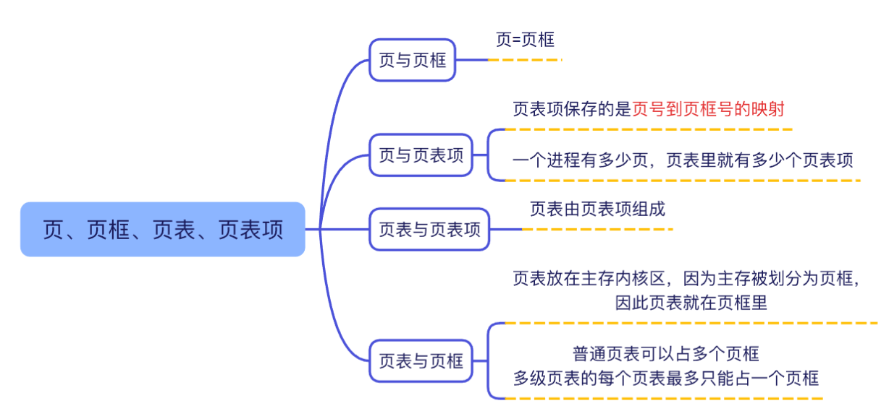
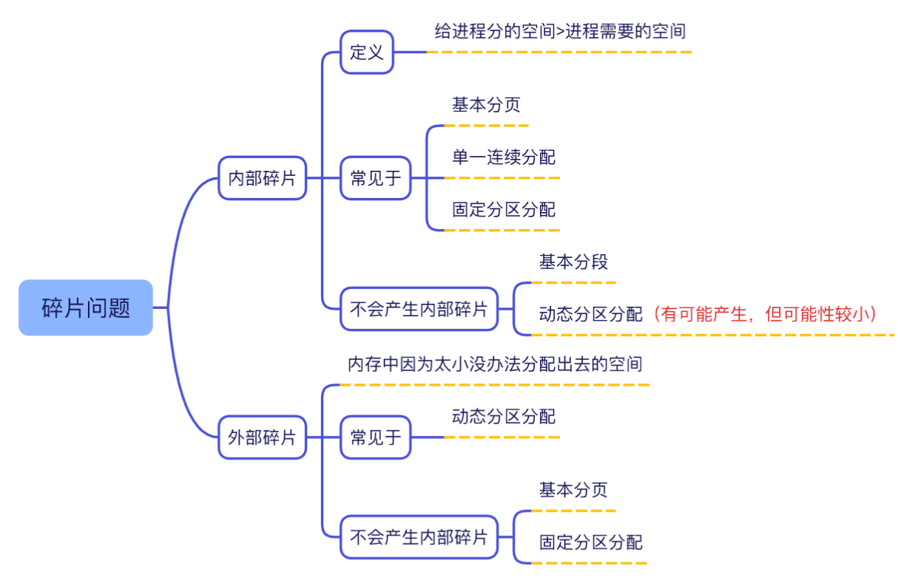
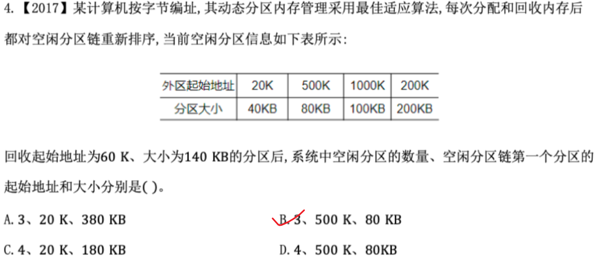
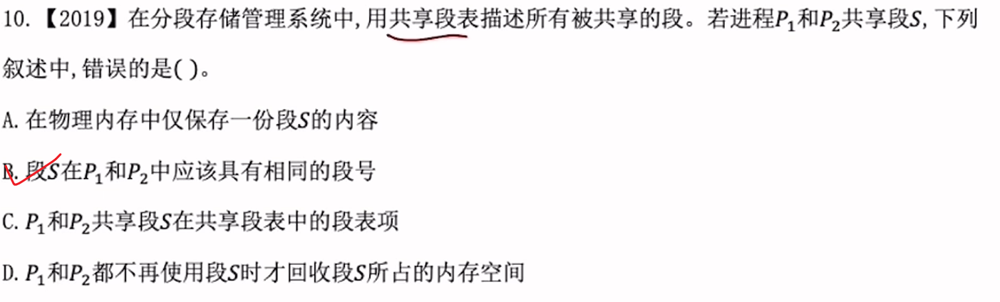
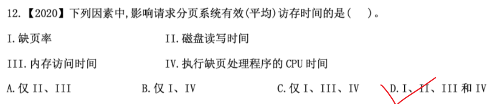
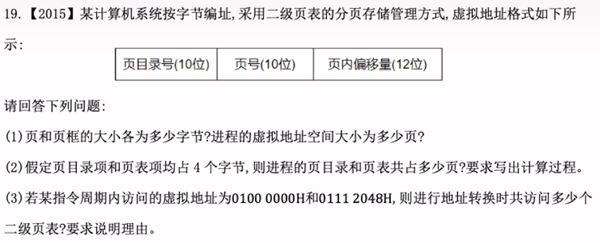
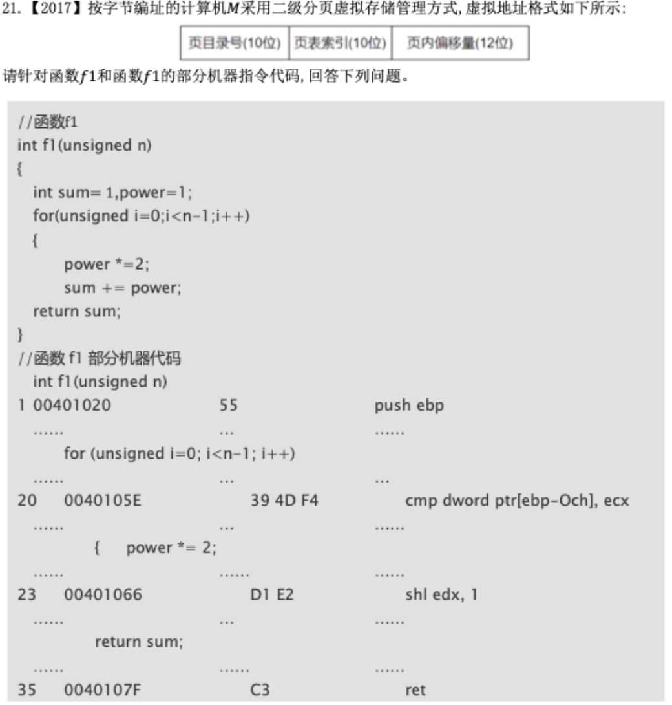

# 页

缺页处理完之后需要重新访问TLB表
访问页表 也是 访问主存

# 真题

坑很多

共享段在不同进程中的逻辑段号**可以不同**。每个进程都有自己独立的逻辑地址空间，进程 $P_1$ 可能把这个共享段映射到自己的第 2 号段，而进程 $P_2$ 把它映射到自己的第 5 号段，只要它们各自段表里的物理基地址指向同一个内存区域即可。

### 核心公式分析

请求分页系统中的有效访存时间（Effective Access Time, EAT）公式为：

$$\text{EAT} = (1 - p) \times t_{\text{mem}} + p \times t_{\text{fault}}$$

其中：

- $p$：**缺页率**（Page Fault Rate）
    
- $t_{\text{mem}}$：**内存访问时间**（Memory Access Time，不缺页时的访问时间）
    
- $t_{\text{fault}}$：**缺页中断处理时间**（Page Fault Overhead）
    

### 选项逐一拆解

1. **I. 缺页率 ($p$)**：直接决定了系统以多大的概率去执行“快速的内存访问”还是“慢速的缺页中断处理”，**有影响**。
    
2. **II. 磁盘读写时间**：发生缺页时，操作系统需要将缺失的页从外存（磁盘）调入内存，如果内存满了还需要将脏页写回磁盘。这部分等待 I/O 的磁盘读写时间是 **缺页中断处理时间 $t_{\text{fault}}$ 的主要组成部分**，**有影响**。
    
3. **III. 内存访问时间 ($t_{\text{mem}}$)**：未发生缺页时直接访问内存的时间，以及缺页处理完成后重新访问内存的时间，**有影响**。
    
4. **IV. 执行缺页处理程序的 CPU 时间**：缺页中断触发后，操作系统需要保存现场、分配页框、更新页表等，这些消耗的 CPU 时间同样包含在 **缺页中断处理时间 $t_{\text{fault}}$** 中，**有影响**。
    

磁盘交换区在外存

第一小问
- **逻辑/虚拟层面（页表记录）：** 因为进程最多需要 6 个页（0 到 5 号），所以操作系统为这个进程建立的**页表本身确实有 6 行**。每一行记录一个逻辑页的状态
    
- **实际物理内存（页框分配）：** 操作系统“只分配了 4 个页框”，意味着**同一时刻物理内存里最多只能硬塞下这 6 页中的 4 个页**。

### 1. 置换前的真实页表状态（时刻 260 之前）

操作系统为该进程维护的完整页表共有 **6 行**：

|**页号 (Page)**|**物理页框号 (Frame)**|**装入时刻**|**访问位**|**有效位 (Present Bit)**|
|---|---|---|---|---|
|**0**|**7**|**130**|**1**|**1**（在内存）|
|**1**|**4**|**230**|**1**|**1**（在内存）|
|**2**|**2**|**200**|**1**|**1**（在内存）|
|**3**|**9**|**260**|**1**|**1**（在内存）|
|**4**|-|-|0|**0**（不在内存）|
|**5**|-|-|0|**0**（不在内存）|

### 2. 发生置换后的真实页表状态（访问页号 5 时）

当进程要访问 **17CAH**（即 **5 号页**）时，操作系统发现 5 号页的有效位为 **0**（缺页），触发 FIFO 替换：

1. 找出最先装入的 **0 号页**（装入时刻 130）。
    
2. 将 **0 号页** 换出：**有效位改为 0**（不再映射到物理内存）。
    
3. 将 **5 号页** 装入 **7 号页框**：更新 5 号页的**页框号为 7**，**装入时刻更新为 260**，**有效位改为 1**。
    

**更新后的真实页表如下：**

|**页号 (Page)**|**物理页框号 (Frame)**|**装入时刻**|**访问位**|**有效位 (Present Bit)**|**备注说明**|
|---|---|---|---|---|---|
|**0**|**-**|**-**|**0**|**0**|**被换出，有效位置 0**|
|**1**|4|230|1|1|保持不变|
|**2**|2|200|1|1|保持不变|
|**3**|9|260|1|1|保持不变|
|**4**|-|-|0|0|保持不变|
|**5**|**7**|**260**|**1**|**1**|**调入内存，占用 7 号页框**|

就看第三小题

要求访问多少个二级页表，本质上是看这两个虚拟地址对应的**最高 10 位（页目录号）**是否相同：如果相同，说明它们使用**同一个**二级页表；如果不同，则使用**不同的**二级页表。

1. **分析逻辑地址的高 10 位（页目录号）：**
    
    - 逻辑地址格式：最高 10 位为页目录号，中间 10 位为二级页号，低 12 位为页内偏移量（即十六进制的后 3 位）。
        
    - 取两个地址的前 5 个十六进制位（前 20 位，即页目录号 + 二级页号）：
        
    - **地址 1：$0100\ 0000\text{H}$**
        
        转换为二进制：$\underbrace{0000\ 0001\ 00}_{\text{高10位（页目录号）}}\ \underbrace{00\ 0000\ 0000}_{\text{中间10位}}\ \underbrace{0000\ 0000\ 0000}_{\text{低12位}}$
        
        - 页目录号 = $0000\ 0001\ 00_2 = \mathbf{4}$
            
    - **地址 2：$0111\ 2048\text{H}$**
        
        转换为二进制：$\underbrace{0000\ 0001\ 00}_{\text{高10位（页目录号）}}\ \underbrace{01\ 0001\ 0010}_{\text{中间10位}}\ \underbrace{0000\ 0100\ 1000}_{\text{低12位}}$
        
        - 页目录号 = $0000\ 0001\ 00_2 = \mathbf{4}$
            
2. **结论判断：**
    
    这两个虚拟地址的高 10 位（页目录号）均为 **4**，说明它们指向**同一个页目录项**，进而映射到**同一个二级页表**。

### 情况一：如果是问访问“二级页表”的次数

**是的，访问次数是 2 次。**

- **原因：** 虽然这两个地址共享 **1 个** 二级页表（属于同一个二级页表），但 CPU 在执行指令时，是先后去查询这两个地址的。
    
- **过程：**
    
    1. 转换第一个地址 $0100\ 0000\text{H}$ 时：读取该二级页表 **1 次**；
        
    2. 转换第二个地址 $0111\ 2048\text{H}$ 时：再次读取该二级页表 **1 次**。
        
- **结论：** 查询的**是同一个**二级页表，但**查询（访问）了这个二级页表 2 次**。
    

### 情况二：如果是问“访问内存”的总次数（大题常考点）

在**没有 TLB（快表）** 的情况下，二级页表机制下**每访问一个虚拟地址，需要访问内存 3 次**：

1. 第 1 次：查**页目录**（一级页表）；
    
2. 第 2 次：查**二级页表**；
    
3. 第 3 次：根据物理地址**访问目标数据/指令**。
    

题目中在一个指令周期内访问了 **2 个虚拟地址**：

- 访问第 1 个地址：内存访问 3 次；
    
- 访问第 2 个地址：内存访问 3 次；
    
- **总共访问内存次数 = $3 \times 2 = \mathbf{6\text{ 次}}$**。
    

### 💡 总结区别：

- 问“涉及/使用了几个二级页表”：**1 个**（因为页目录号相同）。
    
- 问“访问二级页表的次数”：**2 次**（每个地址查 1 次）。
    
- 问“访问内存的总次数”：**6 次**（如果不计 TLB，每个地址 3 次）。

引入快表（TLB）减少访问主存的次数
### 1. 未命中快表（TLB Miss）—— 访问主存 3 次

当 CPU 在快表中没有找到对应的页表项时，必须走正常的二级页表查询流程：

1. **第 1 次访存：** 查内存中的**页目录**（一级页表）。
    
2. **第 2 次访存：** 查内存中的**二级页表**。
    
3. **第 3 次访存：** 找到物理页框号后，**访问真正的目标数据/指令**。
    

### 2. 命中快表（TLB Hit）—— 仅访问主存 1 次

因为 TLB 是集成在 CPU 芯片内部的高速缓存（SRAM），**访问 TLB 的速度极快，且不占用主存（内存）的访问次数**。

当 CPU 在快表中直接查到了物理页框号：

- **查 TLB：** 消耗 CPU 内部时钟周期，**访问主存次数 = 0**。
    
- **第 1 次访存：** 拿着拼好的物理地址，直接去**主存中读取目标数据/指令**。
    

**结果：** 整个过程**只访问了 1 次主存**（直接拿数据），省去了前两次去主存查页表的过程！

### 总结比较

在二级页表系统中，访问一个虚拟地址的主存次数如下：

- **无 TLB 或 TLB 未命中：** **3 次主存访问**（页目录 + 二级页表 + 数据）
    
- **TLB 命中：** **1 次主存访问**（直接读数据）
    

> **💡 考研经典套路点：**
> 
> - 题目中如果说 **“TLB 采用并行查找，与查 TLB 同时进行...”** 或者问 **“主存访问次数”** 时，记住：**TLB 不是主存！** 查 TLB 算作硬件高速缓存查找，不计入“主存访问次数”。
>

### 1. 什么是“指令周期”？

指令周期（Instruction Cycle）指的是 **CPU 执行一条指令所需的全部时间**。

它并不是一个“固定不变的时间片”，而是由多个 CPU 时钟周期组成的。**一条指令需要做多少事，指令周期就会包含多少个时钟周期。**

- 如果是一条简单的加法指令 `ADD R1, R2`，不涉及访存，可能 1~2 个时钟周期就结束了。
    
- 如果是一条需要多次访存的指令（比如带有复杂寻址模式的指令），**指令周期就会自动延伸**，包含更多个时钟周期，直到把所有访存和计算步骤全部做完为止。
    

### 2. 为什么一个指令周期内可以访问这么多次？

在一个指令周期中，硬件是按**流水线/步骤**一步步执行的：

1. **取指阶段（Fetch）：**
    
    CPU 去内存取指令本身（第 1 次访问逻辑地址 $0100\ 0000\text{H}$ 对应的内存）。
    
    - 查页目录 $\rightarrow$ 查二级页表 $\rightarrow$ 读指令内容。
        
2. **执行/访存阶段（Execute）：**
    
    CPU 解析指令后发现需要读取一个操作数，而这个操作数的地址是 $0111\ 2048\text{H}$（第 2 次访问逻辑地址对应的内存）。
    
    - 查页目录 $\rightarrow$ 查二级页表 $\rightarrow$ 读操作数内容。
        

只要硬件设计允许，CPU 就会在同一个指令周期的不同阶段，依次发起这些内存访问请求。

### 3. 硬件层面：速度其实匹配得上

虽然主存（DRAM）比 CPU 慢，但它们在一个数量级的时间尺度上：

- **CPU 主频：** 比如 3 GHz，一个时钟周期约 **0.3 纳秒（ns）**。
    
- **主存访问延迟：** 约 **50~100 纳秒（ns）**。
    

就算在一个指令周期内没有 TLB 命中、连续访问 6 次主存，总耗时也就 **300~600 纳秒**（不到 1 微秒）。对于 CPU 来说，无非就是让指令周期多等了几个百时钟周期（通过插入等待状态 Wait State 或流水线暂停），完全在硬件控制的范围内。

### 总结

**指令周期是“按需伸缩”的。** 指令复杂、访存次数多，指令周期就会变长（包含更多时钟周期），硬件完全有能力在一个指令周期内按顺序把这几次访存全部搞定。

只需关注下面内容，题目可以不用看
第二问回答：
	第2个表项，编号为1。这样比较全面，万一参考答案只给1号表项，但他问的是第几个。
第三问：
	**进程 $P$ 的状态变化**： 进程 $P$ 经历 **执行态 $\rightarrow$ 阻塞态 $\rightarrow$ 就绪态 $\rightarrow$ 执行态**。 
执行 `scanf()` 等待 I/O 输入时，进程从**执行态变为阻塞态**；输入完成后收到中断响应，进程从**阻塞态变为就绪态**；随后再次获得 CPU 调度，从**就绪态变为执行态**继续执行。
**CPU 是否进入内核态**：**会进入内核态**。

