# 进程的内存映像


```
【进程 A 的虚拟地址空间】       【物理内存 (主存)】       【进程 B 的虚拟地址空间】
┌─────────────────────┐       ┌─────────────────┐       ┌─────────────────────┐
│ 3G-4G 内核区 (共享) │ ──────>│                 │ <────── │ 3G-4G 内核区 (共享) │
├─────────────────────┤       │ 操作系统内核区  │       ├─────────────────────┤
│                     │       │                 │       │                     │
│ 0-3G 用户区 (独立)  │ ──┐   └─────────────────┘   ┌── │ 0-3G 用户区 (独立)  │
└─────────────────────┘   │   ┌─────────────────┐   │   └─────────────────────┘
                          └──>│ 进程 A 的代码/数据│   │
                              ├─────────────────┤   │
                              │ 进程 B 的代码/数据│ <─┘
                              └─────────────────┘
```

**考研 408 / 标准教材的概念**中，**一个进程只有一张（套）页表**。

Linux 引入了 **KPTI（Kernel Page Table Isolation，内核页表隔离）技术**。
在启用了 KPTI 的 Linux 系统中，**每一个进程实际上被分配了两张页表**：用户态页表和内核态页表


# 用户级线程ULT
| **比较维度**     | **用户级线程（ULT）**         | **内核级线程（KLT）**     |
| ------------ | ---------------------- | ------------------ |
| **内核能否感知？**  | **完全感知不到**             | **完全感知并直接管理**      |
| **调度单位**     | 进程是调度的基本单位             | **线程**是调度的基本单位     |
| **多核并行能力**   | **不能**（多核只能跑 1 个核）     | **能**（不同线程分给不同核并行） |
| **I/O 阻塞影响** | 一线程阻塞，**整个进程阻塞**       | 一线程阻塞，**其他线程正常运行** |
| **状态切换开销**   | 极小（不产生 CPU 模式切换/内核态转换） | 较小（但需要从用户态切到内核态）变态 |


# 进程调度时机


# 真题

---

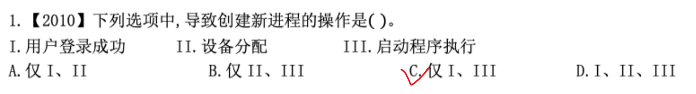
**II. 设备分配（错误）**

- 设备分配是指系统根据进程的请求，将某个 I/O 设备（如打印机、磁盘驱动器）分配给**已存在的某个进程**使用。
    
- 这个过程只是修改了系统的设备分配表或设备控制块（DCB），以及更新进程的阻塞/就绪状态，**并不会创建新的进程**。


---

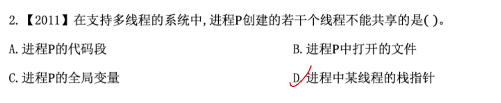栈指针（SP）不共享，但是栈空间可以访问到。
- 同一进程下的所有线程，**共享同一个虚拟地址空间**（MMU 的页表是同一套）。
    
- 操作系统并没有在硬件层面给每个线程的栈加上强硬的内存保护屏障（因为这会极大增加线程切换的开销）。
    
- **这意味着：** 如果线程 A 知道了线程 B 栈上某个局部变量的指针（内存地址），线程 A **完全可以**通过指针直接读写线程 B 栈里的数据。


---

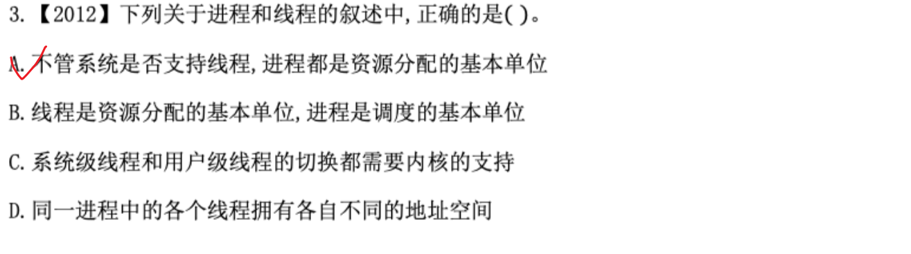


---

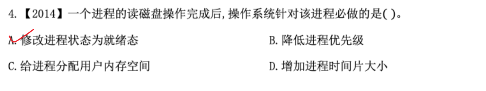
1. **进程状态的变化：**
    
    - 当进程请求读磁盘（I/O 操作）时，由于磁盘读写属于慢速设备操作，进程无法继续执行，会从**运行态**转入**阻塞态（Wait/Blocked）**，等待 I/O 完成。
        
    - 当读磁盘操作完成时，磁盘控制器会向 CPU 发出 **I/O 中断**。
        
    - 操作系统接收到中断信号后，其中断处理程序会将该进程从**阻塞态**修改为**就绪态（Ready）**，并将其插入就绪队列，等待下一次被调度执行。这是操作系统必须（必做）执行的状态转换。
        
2. **排除其他选项：**
    
    - **B. 降低进程优先级**：某些调度算法（如多级反馈队列）甚至会优先照顾 I/O 繁忙型进程（或提高其响应速度），并不存在“必做降低优先级”的规定。
        
    - **C. 给进程分配用户内存空间**：用于存放磁盘数据的内存缓冲区通常在请求读磁盘前或申请时就已经确定并分配好了，读盘完成后无需重新分配。
        
    - **D. 增加进程时间片大小**：时间片大小通常由操作系统统一设定或固定，不会因一次读盘完成而动态增大。
补充操作
### 1. 中断响应与现场保护

- **硬件响应中断**：磁盘控制器完成数据传输（如通过 DMA 方式）后发出中断请求，CPU 接收到请求并转入中断服务程序（ISR）。
    
- **保存被打断进程的 CPU 现场**：将当前正在 CPU 上运行的进程（注意：此时 CPU 上的进程可能与读磁盘的进程无关）的程序计数器（PC）、通用寄存器等上下文压栈保存。
    

### 2. 状态与数据维护

- **更新 PCB（进程控制块）**：除了修改状态为就绪态，还会更新 PCB 中的相关阻塞原因、等待时间统计等信息。
    
- **数据拷贝/指针清理**：如果是采用 DMA 传输，磁盘数据此时已被写入内核缓冲区。操作系统会将数据从内核缓冲区拷贝到用户进程空间（或者更新缓冲区指针，让用户进程可以读取），并释放占用的相关 I/O 资源/设备队列。
    

### 3. 唤醒与调度决策

- **解除阻塞/唤醒进程**：将该进程从“等待磁盘 I/O”的阻塞队列中移出，挂入就绪队列。
    
- **触发进程调度（检查是否抢占）**：
    
    - 操作系统会检查当前调度策略。如果被唤醒的进程优先级高于当前正在运行的进程（或者当前使用的是可抢占式调度），操作系统可能会**立即触发调度程序**，剥夺当前 CPU 上进程的运行权，直接切换到刚读完盘的进程去执行。
        
    - 如果不发生抢占，则继续恢复此前被打断的进程运行。
        

### 4. 恢复现场并返回

- **恢复上下文**：恢复被打断进程（或新调度上的进程）的 CPU 现场。
    
- **中断返回（IRET）**：执行中断返回指令，CPU 重新回到用户态继续执行代码。
    

**总结**：在考研操作系统（408）的视角中，这一套完整流程包含 **“保护现场 $\rightarrow$ 状态变更与数据处理 $\rightarrow$ 移出阻塞队列/挂入就绪队列 $\rightarrow$ 触发调度判断 $\rightarrow$ 恢复现场/中断返回”**。而“修改状态为就绪态”是其中最具代表性且必不可少的核心步骤。


---

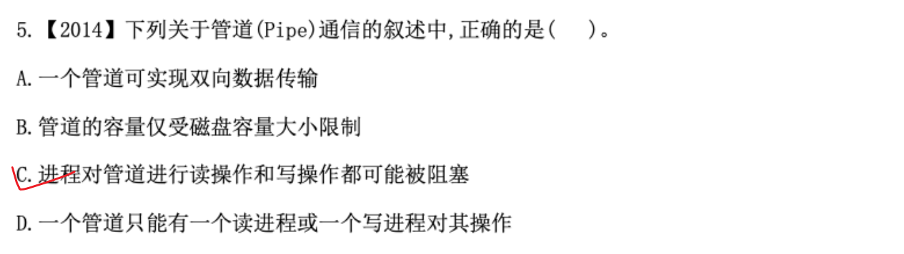
1. **为什么选 C（正确）：**
    
    - **读阻塞**：当管道为空（没有数据可读）时，试图从管道读取数据的进程会被阻塞，直到有写进程向管道中写入数据。
        
    - **写阻塞**：管道本质上是操作系统在**内存**中开辟的一块固定大小的环形缓冲区（Buffer）。当管道被写满时，试图继续写入的进程会被阻塞，直到有读进程从管道中读走数据腾出空间。
        
2. **其他选项错在哪里：**
    
    - **A. 一个管道可实现双向数据传输（错误）**：
        
        普通管道是半双工（或单向）的，数据只能在一个方向上传输。如果需要实现双向通信，必须建立两个管道。
        
    - **B. 管道的容量仅受磁盘容量大小限制（错误）**：
        
        管道是存在于**内存**中的特定大小的缓冲区，并不在磁盘上。因此它的容量受到内存大小及系统对管道缓冲区上限（如 Linux 中的 `PIPE_BUF` 或 `pipe-max-size`）的限制，与磁盘容量无关。
        
    - **D. 一个管道只能有一个读进程或一个写进程对其操作（错误）**：
        
        一个管道可以允许**多个读进程或多个写进程**同时访问（例如父进程创建管道后 fork 出多个子进程共享该管道文件描述符）。操作系统底层会通过互斥机制来保证多个进程读写管道时的安全性。

**补充：**

**管道（Pipe）通信**是操作系统中一种最基础的**进程间通信（IPC，Inter-Process Communication）机制**。

简单来说，它的本质就是操作系统在内核中开辟的一块**共享内存缓冲区**。你可以把它想象成一条连接两个进程的“单向水管”：

```
[写进程]  --->  ===【 管道（内存缓冲区） 】===  --->  [读进程]
 (向管道写入)                                      (从管道读取)
```

### 1. 管道通信的核心特点

为了彻底搞懂它，记住以下四个关键特性：

- **1. 半双工（单向）通信**
    
    数据只能在一个方向流动，就像单行道。一端固定用来**写**，另一端固定用来**读**。如果你需要两个进程相互收发消息，就必须建立**两条**管道。
    
- **2. 机制基于“先进先出”（FIFO）**
    
    数据就像水流一样，先写入的数据一定会被先读取出来，不能随机跳着读。
    
- **3. 基于字符流/字节流传输**
    
    管道不关心传输数据的格式，只把它当成一串无差别的字节流。
    
- **4. 自带“同步与互斥”机制**
    
    这就是选项 C 提到的**阻塞**原因：
    
    - **缓冲区空了**：读进程再去读就会被**阻塞（挂起）**，直到写进程写入新数据。
        
    - **缓冲区满了**：写进程再去写就会被**阻塞（挂起）**，直到读进程读走数据腾出空间。
        
    - **互斥访问**：操作系统会保证同一时间只有一个进程在向管道写或读，防止数据写乱。
        

### 2. 管道在操作系统中是怎么实现的？

在 UNIX/Linux 系统中，**“一切皆文件”**。

1. **以文件形式存在**：操作系统把管道看作一种特殊的“伪文件”。进程可以通过普通的 `read()` 和 `write()` 系统调用来操作它。
    
2. **存在于内存而非磁盘**：虽然它在进程看起来像一个文件，但它完全保存在**内存**中（这就是为什么选项 B“受磁盘容量限制”是错的）。


---

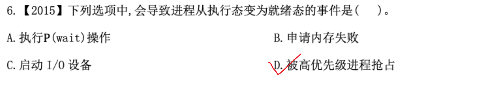

题目问的是：**执行态 $\rightarrow$ 就绪态**（Running $\rightarrow$ Ready）。

1. **为什么选 D（正确）：**
    
    - 由于该进程**本身并没有等待任何外部事件或资源**（它随时可以继续运行，只是没有 CPU 资源），所以它会直接从**执行态**转变为**就绪态**，重新回就绪队列排队。
        
2. **排除其他选项（都是 执行态 $\rightarrow$ 阻塞态）：**
    
    - **A. 执行 P(wait) 操作**：P说明要申请一个资源所以肯定不会是就绪态。
    - 如果信号量 $S \le 0$，进程执行 P 操作后会被挂起，从**执行态 $\rightarrow$ 阻塞态**，等待被 V(signal) 操作唤醒。
        
    - **B. 申请内存失败**：无法获得所需的内存资源，进程无法继续向下执行，会从**执行态 $\rightarrow$ 阻塞态**，等待系统释放并分配内存。
        
    - **C. 启动 I/O 设备**：进程主动请求 I/O 操作（如读写磁盘/打印机），在等待慢速 I/O 设备完成工作的过程中，进程无法继续占用 CPU，会从**执行态 $\rightarrow$ 阻塞态**。
        


---

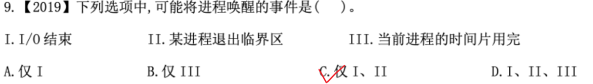

**唤醒是指将一个进程从阻塞态（Wait/Blocked）变为就绪态（Ready）**。

**III.下一个使用cpu的是 原先就是就绪态的 ，所以是从 就绪态 变为 执行态，不是唤醒的过程。


---

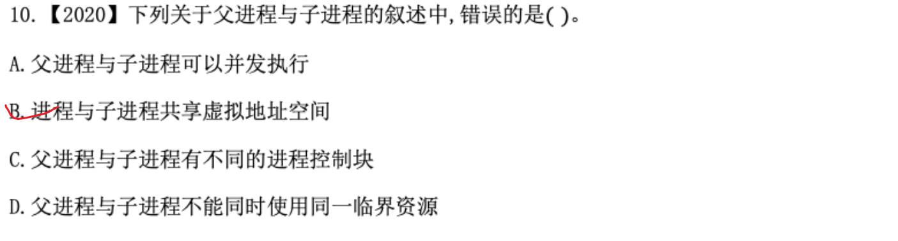

A：在子进程被创建（如调用 `fork()`）之后，父进程和子进程是两个独立调度的实体，它们可以由操作系统调度并发（或并行）地执行。

B: **独立的地址空间：** 进程是资源分配的基本单位。子进程创建时，会复制父进程的地址空间（或采用写时复制 Copy-on-Write 机制），但它们拥有**各自独立的虚拟地址空间**。
**互不影响：** 子进程修改自己的变量或内存，不会影响到父进程的虚拟地址空间。因此说它们“共享”虚拟地址空间是不准确的（只有同一个进程内的不同**线程**才会共享进程的虚拟地址空间）。

C: 每个进程在操作系统中都有一个唯一的 **PCB**


---

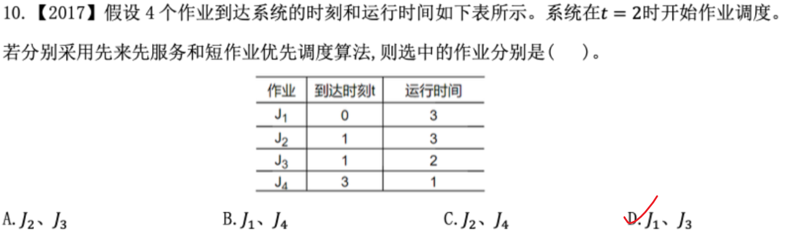

关键点在于T=2才开始运行
短作业优先调度算法默认是非抢占式的。


---

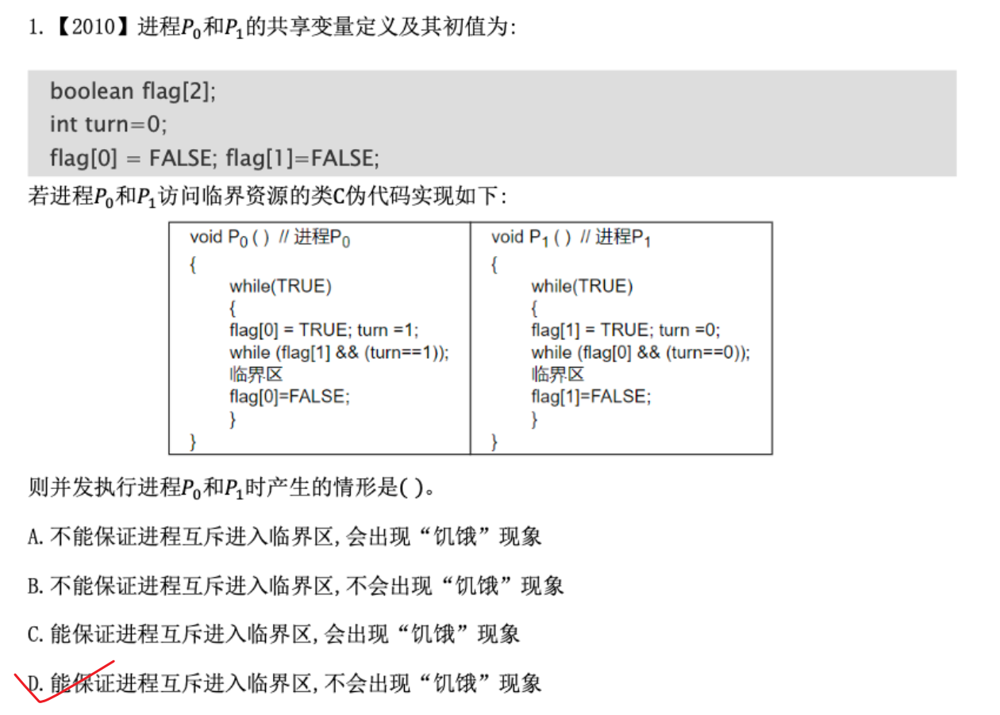


---

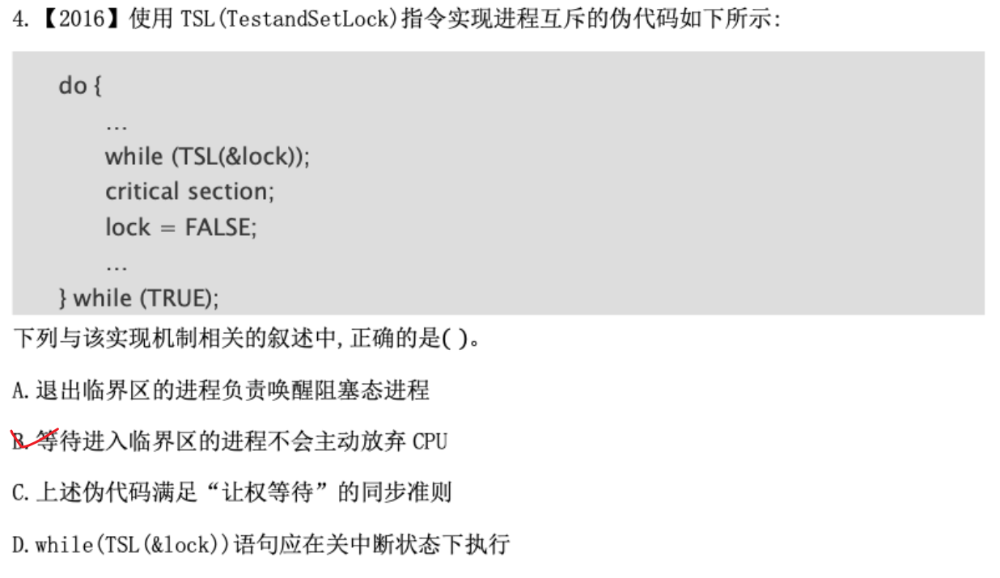

A: 使用 TSL 指令实现互斥时，没有进入临界区的进程一直在执行 `while (TSL(&lock));` 死循环，处于**就绪态/运行态**进行“忙等”（Busy Waiting），根本没有进入**阻塞态**。因此退出临界区时只需执行 `lock = FALSE;`，并不需要唤醒任何进程。

| **对比维度**       | **TSL 指令 / 自旋锁（忙等）**              | **P / V 信号量机制（阻塞-唤醒）**            |
| -------------- | --------------------------------- | --------------------------------- |
| **未拿到锁的状态**    | **就绪态/运行态**（在 `while` 死循环中消耗 CPU） | **阻塞态**（放弃 CPU，进入等待队列）            |
| **是否违反“让权等待”** | **违反**（一直在忙等，浪费 CPU 时间）           | **遵循**（拿不到锁就主动让出 CPU）             |
| **释放资源时的操作**   | 直接修改锁标志 `lock = FALSE`            | 执行 **`V` 操作**，由 OS **唤醒**阻塞队列中的进程 |
  唤醒主体：
  - **正确表述（逻辑/应用层）：** “进程 1（通过系统调用/V操作）唤醒了进程 2”。

  - **正确表述（系统/内核层）：** “操作系统（内核）唤醒了进程 2”。

  - **错误表述：** “CPU 唤醒了进程 2”（混淆了硬件执行者与操作系统管理者的概念）。

B: 在伪代码中，如果 `lock` 为 `TRUE`（已被其他进程占用），TSL 指令返回 `TRUE`，进程就会一直在 `while(TSL(&lock));` 循环中消耗 CPU 时间，也就是常说的**忙等（Busy Waiting）**或**自旋（Spin Lock）**，它不会主动放弃 CPU。

C: **让权等待**是指当进程不能进入临界区时，应立即释放 CPU，进入阻塞状态，避免浪费 CPU 资源。而这段伪代码一直在循环消耗 CPU（忙等），违背了“让权等待”原则。

D:TSL 是由**硬件电路在指令执行周期内保证其原子性**（通过总线锁或缓存一致性协议），属于硬件指令级的原子操作。它本身就是一条独立的硬件指令，**不需要依靠软件层的关中断**来实现原子性。
需要中断来进行 调度


# PV操作（重点，今年可能会考）

先确定模型 
生产者和消费者、读者和写者、哲学家
### 一、 同步互斥关键区别总结

| **维度**    | **同步（Synchronization）**             | **互斥（Mutual Exclusion）**                  |
| --------- | ----------------------------------- | ----------------------------------------- |
| **核心目的**  | 解决**顺序问题**（先做 A，再做 B）。              | 解决**冲突问题**（不能同时用同一个东西）。                   |
| **进程关系**  | 进程间是**合作关系**，为了完成某个任务互相配合。          | 进程间是**竞争关系**，为了抢夺同一个临界资源。                 |
| **信号量初值** | 通常初始化为 **0**（或者资源的最大数量 $N$）。        | 通常初始化为 **1**（因为独占资源只有 1 份）。               |
| **核心机制**  | 一个进程负责 $V$（释放信号），另一个进程负责 $P$（等待信号）。 | 同一个进程在临界区前后**自己执行 $P$ 和 $V$**（自己加锁，自己解锁）。 |

### 二、 什么时候考虑“同步”？

当你看到题目中有以下标志时，直接按**同步**来处理：

1. **显式的依赖关系/先后顺序**：
    
    - 比如“只有 A 算完了，B 才能开始算”、“C 必须在 A 和 B 都完成后执行”（如前驱图题目）。
        
    - **逻辑**：前驱进程执行完后调用 $V(S)$ 唤醒，后继进程执行前调用 $P(S)$ 阻塞等待。
        
2. **经典的“生产者-消费者”模式**：
    
    - 必须先生产了数据/产品，消费者才能去拿。如果缓冲区为空，消费者必须等待。
        
    - **逻辑**：没有资源就不能消费（依赖“生产”这个前置动作）。
        

> **信号量特征**：$P$ 操作和 $V$ 操作出现在**不同的进程**中。
> 
> - 进程 A 执行：`……; V(S);`（通知 A 完成）
>     
> - 进程 B 执行：`P(S); ……;`（等待 A 完成）
>     

### 三、 什么时候考虑“互斥”？

当你看到题目中有以下标志时，直接按**互斥**来处理：

1. **共享临界资源（同一时刻只允许一个进程使用）**：
    
    - 比如：打印机、全局变量（如缓冲区计数器 `count`）、独占的文件、哲学家问题里的每一根筷子。
        
2. **并发修改共享数据**：
    
    - 如果多个进程同时对同一个数据结构进行写操作（比如同时往队列里插入数据），如果不加互斥锁，就会导致数据错乱。
        

> **信号量特征**：$P$ 操作和 $V$ 操作成对出现在**同一个进程**的临界区代码段前后。
> 
> - 进程 A 执行：`P(mutex); 修改共享资源; V(mutex);`
>     
> - 进程 B 执行：`P(mutex); 修改共享资源; V(mutex);`
>     

### 四、 快速判断口诀

- **有先后顺序、依赖前置条件 $\rightarrow$ 看作【同步】**（信号量初值设为 $0$）。
    
- **抢同一个独占资源、防止并发冲突 $\rightarrow$ 看作【互斥】**（信号量初值设为 $1$）。
    


## T1


### 一、 关系分析与信号量定义

1. **互斥关系**：
    
    - 三个进程共享同一个缓冲区，对缓冲区的访问必须互斥。
        
    - 设置互斥信号量 `mutex = 1`。
        
2. **同步关系**：
    
    - **缓冲区空位**：$P_1$ 必须有空位才能放入数据。设置信号量 `empty = N`。
        
    - **缓冲区中的奇数**：$P_2$ 必须有奇数才能取出。设置信号量 `odd = 0`。
        
    - **缓冲区中的偶数**：$P_3$ 必须有偶数才能取出。设置信号量 `even = 0`。
        

#### 信号量含义说明：

- `mutex`：互斥信号量，初值为 1，用于控制三个进程对缓冲区的互斥访问。
    
- `empty`：同步信号量，初值为 $N$，表示缓冲区中可用的空单元数量。
    
- `odd`：同步信号量，初值为 0，表示缓冲区中当前的奇数个数。
    
- `even`：同步信号量，初值为 0，表示缓冲区中当前的偶数个数。
    

### 二、 伪代码实现

```
// 信号量定义与初始化
semaphore mutex = 1;  // 缓冲区互斥锁
semaphore empty = N;  // 空闲单元数，初始为 N
semaphore odd = 0;    // 奇数个数，初始为 0
semaphore even = 0;   // 偶数个数，初始为 0

// ================= 进程 P1（生产者） =================
void P1() {
    int x;
    while (1) {
        x = produce();     // 生成一个正整数（非临界区操作，放在外面）
        
        P(empty);          // 1. 同步：检查是否有空单元（外层套同步）
        P(mutex);          // 2. 互斥：申请缓冲区锁（内层紧包裹）
        
        put();             // 核心临界区：将 x 送入缓冲区某一空单元中
        
        V(mutex);          // 释放缓冲区锁
        
        // 根据生成的数是奇数还是偶数，分别唤醒 P2 或 P3
        if (x % 2 != 0) {
            V(odd);        // 3. 同步：奇数数量 +1，唤醒 P2
        } else {
            V(even);       // 3. 同步：偶数数量 +1，唤醒 P3
        }
    }
}

// ================= 进程 P2（奇数消费者） =================
void P2() {
    while (1) {
        P(odd);            // 1. 同步：检查是否有奇数（外层套同步）
        P(mutex);          // 2. 互斥：申请缓冲区锁
        
        getodd();          // 核心临界区：从缓冲区取出一个奇数
        
        V(mutex);          // 释放缓冲区锁
        V(empty);          // 3. 同步：腾出一个空单元，唤醒 P1
        
        countodd();        // 统计奇数个数（非临界区操作，放在外面）
    }
}

// ================= 进程 P3（偶数消费者） =================
void P3() {
    while (1) {
        P(even);           // 1. 同步：检查是否有偶数（外层套同步）
        P(mutex);          // 2. 互斥：申请缓冲区锁
        
        geteven();         // 核心临界区：从缓冲区取出一个偶数
        
        V(mutex);          // 释放缓冲区锁
        V(empty);          // 3. 同步：腾出一个空单元，唤醒 P1
        
        counteven();       // 统计偶数个数（非临界区操作，放在外面）
    }
}
```

### 💡 得分要点与陷阱提醒

1. **`produce()`、`countodd()` 和 `counteven()` 绝不能写在 `P(mutex)` 和 `V(mutex)` 里面**：
    
    - 这些都是各自进程内部的计算操作，不消耗或修改共享资源。压缩互斥区，把它们放在锁外面，可以极大地提升多并发效率。
        
2. **`P(empty)/P(odd)/P(even)` 一定要在 `P(mutex)` 外层**：
    
    - 如果先 `P(mutex)` 再 `P(empty)`，当缓冲区满时，$P_1$ 会带着 `mutex` 锁进入阻塞，而 $P_2$ 和 $P_3$ 因为拿不到 `mutex` 锁也无法去取数腾空位，**直接引发死锁**。


## T2


### 一、 信号量定义与初值

为了实现顾客与营业员之间的同步与互斥，设置以下 4 个信号量：

1. **`seats`**（初值 **10**）：资源信号量，表示银行内剩余的空座位数量。
    
2. **`mutex`**（初值 **1**）：互斥信号量，用于保证同一时刻只有一位顾客使用取号机。
    
3. **`customers`**（初值 **0**）：同步信号量，表示正在等待叫号的顾客数量。
    
4. **`service`**（初值 **0**）：同步信号量，表示营业员已叫号，通知顾客接受服务。
    

### 二、 完整伪代码实现

```
semaphore seats = 10;      // 空座位数，初值为10
semaphore mutex = 1;       // 取号机互斥信号量，初值为1
semaphore customers = 0;   // 等待叫号的顾客数，初值为0
semaphore service = 0;     // 营业员叫号信号，初值为0

Cobegin{
    process 顾客 i
    {
        P(seats);          // 1. 检查是否有空座位，无座位则在门口等待
        P(mutex);          // 2. 申请互斥使用取号机
        从取号机获取一个号码;
        V(mutex);          // 3. 释放取号机
        
        V(customers);      // 4. 通知营业员有顾客在等待
        P(service);        // 5. 等待营业员叫号
        V(seats);          // 6. 被叫到号，离开座位（释放座位资源）
        获取服务;
    }

    process 营业员
    {
        while (TRUE)
        {
            P(customers);  // 1. 检查是否有顾客等待，无顾客则阻塞休眠
            叫号;
            V(service);    // 2. 发出叫号信号，唤醒等待的顾客
            为客户服务;
        }
    }
}Coend
```

### 三、 关键逻辑说明

1. **座位控制**：顾客到达时先执行 `P(seats)`，若无空座位（`seats == 0`）则阻塞在银行外；被叫号后执行 `V(seats)` 腾出座位供后续顾客使用。
    
2. **取号机互斥**：使用 `mutex` 对取号机加锁，确保“取号”操作是原子性的，防止多位顾客同时取号产生冲突。
    
3. **顾客与营业员同步**：
    
    - **`customers` 信号量**：顾客取号后执行 `V(customers)` 告知营业员；营业员通过 `P(customers)` 等待顾客到来。
        
    - **`service` 信号量**：营业员叫号后执行 `V(service)`；顾客通过 `P(service)` 等待被叫号。


**不可以**将 `V(service)` 放在“为客户服务”后面。

这里涉及经典的**进程同步与并发顺序**问题，核心原因如下：
    

### 2. 违反“叫号与接受服务”的逻辑顺序

在实际逻辑中，`service` 信号量的作用是**通知顾客“轮到你了，可以过来接受服务了”**。

- 营业员叫号后执行 `V(service)`，是在**发通知**；
    
- 顾客收到 `P(service)` 信号被唤醒，双方才能**同时/配合**开始“服务与被服务”的过程。
    

如果营业员不先发通知（不 `V(service)`），顾客就一直处于等待状态，双方无法完成对接。

### 总结

`V(service)` 的本质是**叫号通知**，必须放在“为客户服务”**之前**；同理，顾客的 `P(service)` 也是在等待这个通知，通过后才能进入“获取服务”。


##  T3


这道题的核心考点在于：**要求一个消费者进程必须“连续取出 10 件产品”后，其他消费者才能取产品**。    ==连续操作的外层需要 套一个PV==

### 一、 关键逻辑分析

1. **基本同步关系（生产者与消费者）**：
    
    - `empty`：表示缓冲区空位置数，初值为 **1000**。
        
    - `full`：表示缓冲区产品数，初值为 **0**。
        
2. **基本互斥关系（对缓冲区的访问）**：
    
    - 生产者和消费者在往缓冲区放/取产品时，需要对缓冲区进行互斥访问。
        
    - `mutex`：控制所有进程（生产者与生产者、生产者与消费者、消费者与消费者）对缓冲区的互斥访问，初值为 **1**。
        
3. **特殊限定条件（消费者之间的互斥与批量操作）**：
    
    - “一个消费者连续取出 10 件产品后，其他消费者才能取”。
        
    - 这意味着**消费者与消费者之间**需要加一把额外的互斥锁，保证一旦某个消费者开始取产品，它能独占“连续取 10 次”的权利。
        
    - `mutex_consumer`：控制消费者之间的互斥访问，初值为 **1**。
        

### 二、 信号量定义与初值

C

```
semaphore empty = 1000;      // 空缓冲区数量，初值为 1000
semaphore full = 0;          // 满缓冲区（产品）数量，初值为 0
semaphore mutex = 1;         // 访问缓冲区的互斥信号量，初值为 1
semaphore mutex_consumer = 1;// 消费者之间的互斥信号量（保证连续取10件），初值为 1
```

### 三、 完整 PV 操作代码

C

```
cobegin
// 生产者进程
producer() {
    while(1) {
        生产一件产品;
        
        P(empty);       // 申请一个空缓冲区
        
        P(mutex);       // 申请互斥访问缓冲区
        将产品放入缓冲区;
        V(mutex);       // 释放缓冲区互斥锁
        
        V(full);        // 增加一个满缓冲区（产品）
    }
}

// 消费者进程
consumer() {
    while(1) {
        P(mutex_consumer); // 抢占“连续取10件产品”的独占权，阻止其他消费者干扰
        
        for (int i = 0; i < 10; i++) {
            P(full);        // 申请一件产品（若没有产品则等待，但依然持有 mutex_consumer）
            
            P(mutex);       // 申请互斥访问缓冲区
            从缓冲区取出一件产品;
            V(mutex);       // 释放缓冲区互斥锁
            
            V(empty);       // 释放一个空缓冲区
            
            使用产品;
        }
        
        V(mutex_consumer); // 完成连续 10 次抽取，释放消费者独占锁，允许其他消费者竞争
    }
}
coend
```


## T4

本题读写问题，读读不互斥 ，读写互斥


## T5

注意到只有同步，没有互斥


## T6


第三小题有点阴，考的是用户态不能执行开关中断指令


