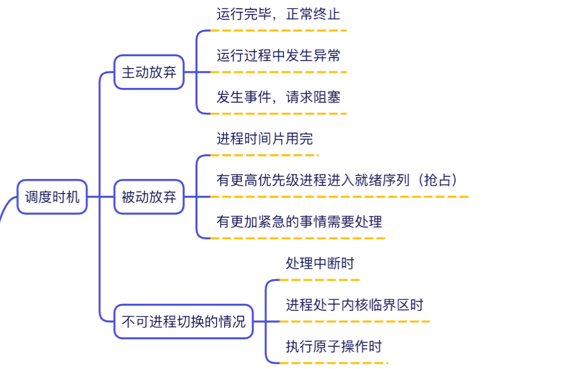
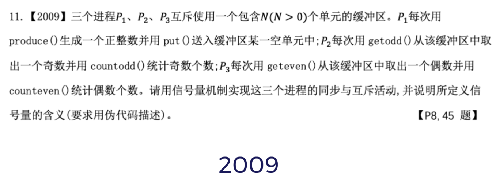
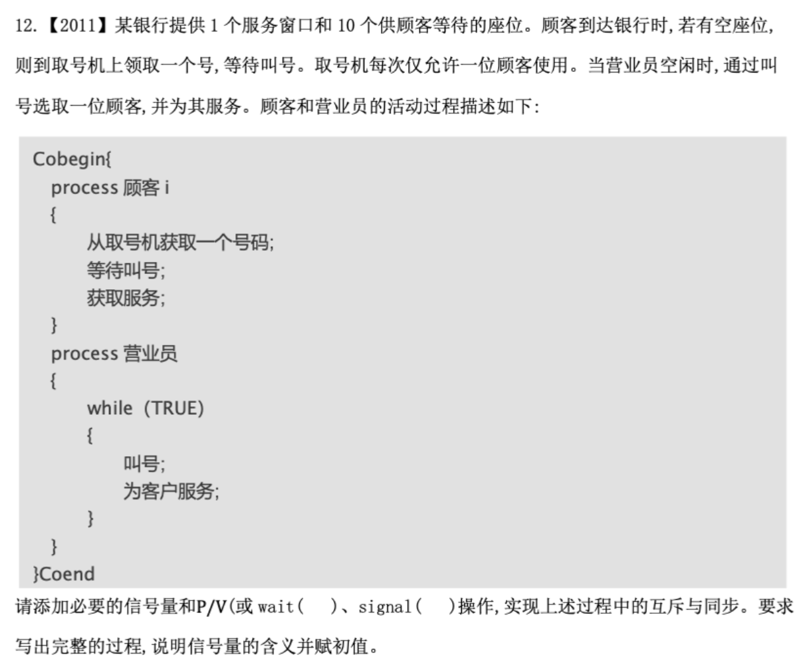
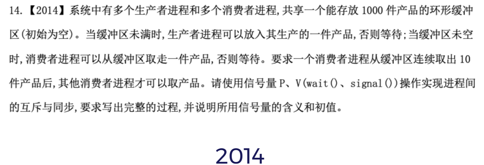
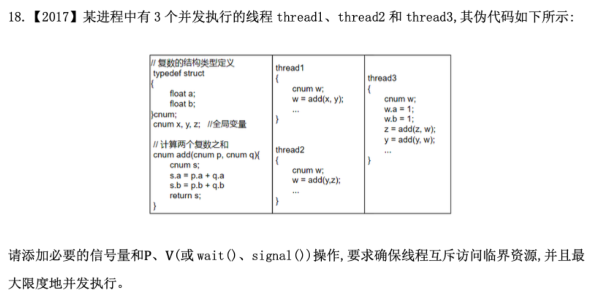
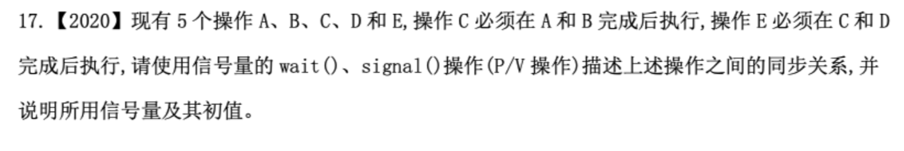
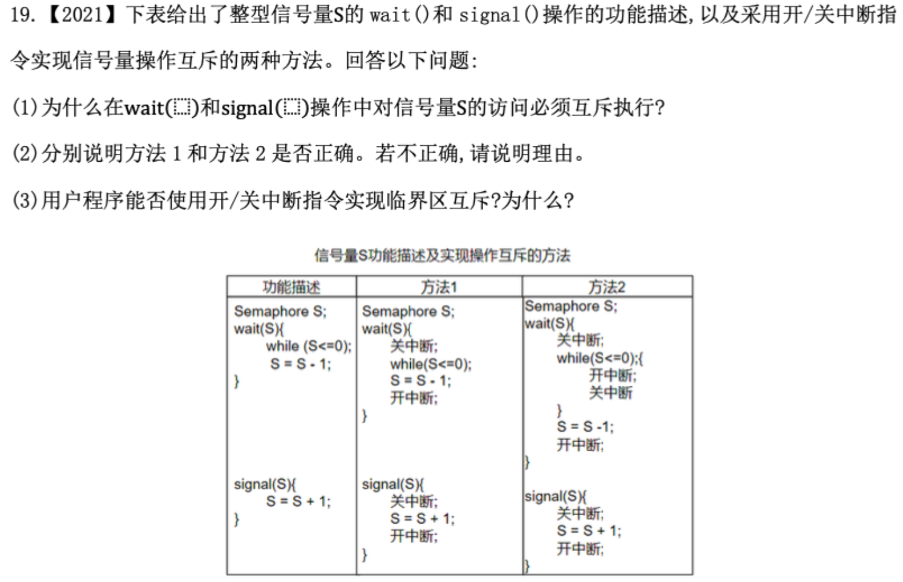
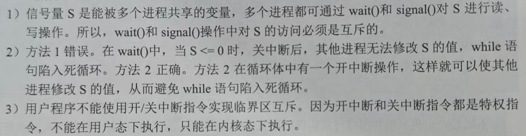

# 进程的内存映像


```
【进程 A 的虚拟地址空间】       【物理内存 (主存)】       【进程 B 的虚拟地址空间】
┌─────────────────────┐       ┌─────────────────┐       ┌─────────────────────┐
│ 3G-4G 内核区 (共享) │ ──────>│                 │ <────── │ 3G-4G 内核区 (共享) │
├─────────────────────┤       │ 操作系统内核区  │       ├─────────────────────┤
│                     │       │                 │       │                     │
│ 0-3G 用户区 (独立)  │ ──┐   └─────────────────┘   ┌── │ 0-3G 用户区 (独立)  │
└─────────────────────┘   │   ┌─────────────────┐   │   └─────────────────────┘
                          └──>│ 进程 A 的代码/数据│   │
                              ├─────────────────┤   │
                              │ 进程 B 的代码/数据│ <─┘
                              └─────────────────┘
```

**考研 408 / 标准教材的概念**中，**一个进程只有一张（套）页表**。

Linux 引入了 **KPTI（Kernel Page Table Isolation，内核页表隔离）技术**。
在启用了 KPTI 的 Linux 系统中，**每一个进程实际上被分配了两张页表**：用户态页表和内核态页表


# 用户级线程ULT
| **比较维度**     | **用户级线程（ULT）**         | **内核级线程（KLT）**     |
| ------------ | ---------------------- | ------------------ |
| **内核能否感知？**  | **完全感知不到**             | **完全感知并直接管理**      |
| **调度单位**     | 进程是调度的基本单位             | **线程**是调度的基本单位     |
| **多核并行能力**   | **不能**（多核只能跑 1 个核）     | **能**（不同线程分给不同核并行） |
| **I/O 阻塞影响** | 一线程阻塞，**整个进程阻塞**       | 一线程阻塞，**其他线程正常运行** |
| **状态切换开销**   | 极小（不产生 CPU 模式切换/内核态转换） | 较小（但需要从用户态切到内核态）变态 |


# 进程调度时机


# PV操作

先确定模型 
生产者和消费者、读者和写者、哲学家
### 一、 同步互斥关键区别总结

| **维度**    | **同步（Synchronization）**             | **互斥（Mutual Exclusion）**                  |
| --------- | ----------------------------------- | ----------------------------------------- |
| **核心目的**  | 解决**顺序问题**（先做 A，再做 B）。              | 解决**冲突问题**（不能同时用同一个东西）。                   |
| **进程关系**  | 进程间是**合作关系**，为了完成某个任务互相配合。          | 进程间是**竞争关系**，为了抢夺同一个临界资源。                 |
| **信号量初值** | 通常初始化为 **0**（或者资源的最大数量 $N$）。        | 通常初始化为 **1**（因为独占资源只有 1 份）。               |
| **核心机制**  | 一个进程负责 $V$（释放信号），另一个进程负责 $P$（等待信号）。 | 同一个进程在临界区前后**自己执行 $P$ 和 $V$**（自己加锁，自己解锁）。 |

### 二、 什么时候考虑“同步”？

当你看到题目中有以下标志时，直接按**同步**来处理：

1. **显式的依赖关系/先后顺序**：
    
    - 比如“只有 A 算完了，B 才能开始算”、“C 必须在 A 和 B 都完成后执行”（如前驱图题目）。
        
    - **逻辑**：前驱进程执行完后调用 $V(S)$ 唤醒，后继进程执行前调用 $P(S)$ 阻塞等待。
        
2. **经典的“生产者-消费者”模式**：
    
    - 必须先生产了数据/产品，消费者才能去拿。如果缓冲区为空，消费者必须等待。
        
    - **逻辑**：没有资源就不能消费（依赖“生产”这个前置动作）。
        

> **信号量特征**：$P$ 操作和 $V$ 操作出现在**不同的进程**中。
> 
> - 进程 A 执行：`……; V(S);`（通知 A 完成）
>     
> - 进程 B 执行：`P(S); ……;`（等待 A 完成）
>     

### 三、 什么时候考虑“互斥”？

当你看到题目中有以下标志时，直接按**互斥**来处理：

1. **共享临界资源（同一时刻只允许一个进程使用）**：
    
    - 比如：打印机、全局变量（如缓冲区计数器 `count`）、独占的文件、哲学家问题里的每一根筷子。
        
2. **并发修改共享数据**：
    
    - 如果多个进程同时对同一个数据结构进行写操作（比如同时往队列里插入数据），如果不加互斥锁，就会导致数据错乱。
        

> **信号量特征**：$P$ 操作和 $V$ 操作成对出现在**同一个进程**的临界区代码段前后。
> 
> - 进程 A 执行：`P(mutex); 修改共享资源; V(mutex);`
>     
> - 进程 B 执行：`P(mutex); 修改共享资源; V(mutex);`
>     

### 四、 快速判断口诀

- **有先后顺序、依赖前置条件 $\rightarrow$ 看作【同步】**（信号量初值设为 $0$）。
    
- **抢同一个独占资源、防止并发冲突 $\rightarrow$ 看作【互斥】**（信号量初值设为 $1$）。
    


## T1


### 一、 关系分析与信号量定义

1. **互斥关系**：
    
    - 三个进程共享同一个缓冲区，对缓冲区的访问必须互斥。
        
    - 设置互斥信号量 `mutex = 1`。
        
2. **同步关系**：
    
    - **缓冲区空位**：$P_1$ 必须有空位才能放入数据。设置信号量 `empty = N`。
        
    - **缓冲区中的奇数**：$P_2$ 必须有奇数才能取出。设置信号量 `odd = 0`。
        
    - **缓冲区中的偶数**：$P_3$ 必须有偶数才能取出。设置信号量 `even = 0`。
        

#### 信号量含义说明：

- `mutex`：互斥信号量，初值为 1，用于控制三个进程对缓冲区的互斥访问。
    
- `empty`：同步信号量，初值为 $N$，表示缓冲区中可用的空单元数量。
    
- `odd`：同步信号量，初值为 0，表示缓冲区中当前的奇数个数。
    
- `even`：同步信号量，初值为 0，表示缓冲区中当前的偶数个数。
    

### 二、 伪代码实现

```
// 信号量定义与初始化
semaphore mutex = 1;  // 缓冲区互斥锁
semaphore empty = N;  // 空闲单元数，初始为 N
semaphore odd = 0;    // 奇数个数，初始为 0
semaphore even = 0;   // 偶数个数，初始为 0

// ================= 进程 P1（生产者） =================
void P1() {
    int x;
    while (1) {
        x = produce();     // 生成一个正整数（非临界区操作，放在外面）
        
        P(empty);          // 1. 同步：检查是否有空单元（外层套同步）
        P(mutex);          // 2. 互斥：申请缓冲区锁（内层紧包裹）
        
        put();             // 核心临界区：将 x 送入缓冲区某一空单元中
        
        V(mutex);          // 释放缓冲区锁
        
        // 根据生成的数是奇数还是偶数，分别唤醒 P2 或 P3
        if (x % 2 != 0) {
            V(odd);        // 3. 同步：奇数数量 +1，唤醒 P2
        } else {
            V(even);       // 3. 同步：偶数数量 +1，唤醒 P3
        }
    }
}

// ================= 进程 P2（奇数消费者） =================
void P2() {
    while (1) {
        P(odd);            // 1. 同步：检查是否有奇数（外层套同步）
        P(mutex);          // 2. 互斥：申请缓冲区锁
        
        getodd();          // 核心临界区：从缓冲区取出一个奇数
        
        V(mutex);          // 释放缓冲区锁
        V(empty);          // 3. 同步：腾出一个空单元，唤醒 P1
        
        countodd();        // 统计奇数个数（非临界区操作，放在外面）
    }
}

// ================= 进程 P3（偶数消费者） =================
void P3() {
    while (1) {
        P(even);           // 1. 同步：检查是否有偶数（外层套同步）
        P(mutex);          // 2. 互斥：申请缓冲区锁
        
        geteven();         // 核心临界区：从缓冲区取出一个偶数
        
        V(mutex);          // 释放缓冲区锁
        V(empty);          // 3. 同步：腾出一个空单元，唤醒 P1
        
        counteven();       // 统计偶数个数（非临界区操作，放在外面）
    }
}
```

### 💡 得分要点与陷阱提醒

1. **`produce()`、`countodd()` 和 `counteven()` 绝不能写在 `P(mutex)` 和 `V(mutex)` 里面**：
    
    - 这些都是各自进程内部的计算操作，不消耗或修改共享资源。压缩互斥区，把它们放在锁外面，可以极大地提升多并发效率。
        
2. **`P(empty)/P(odd)/P(even)` 一定要在 `P(mutex)` 外层**：
    
    - 如果先 `P(mutex)` 再 `P(empty)`，当缓冲区满时，$P_1$ 会带着 `mutex` 锁进入阻塞，而 $P_2$ 和 $P_3$ 因为拿不到 `mutex` 锁也无法去取数腾空位，**直接引发死锁**。


## T2



### 一、 信号量定义与初值

为了实现顾客与营业员之间的同步与互斥，设置以下 4 个信号量：

1. **`seats`**（初值 **10**）：资源信号量，表示银行内剩余的空座位数量。
    
2. **`mutex`**（初值 **1**）：互斥信号量，用于保证同一时刻只有一位顾客使用取号机。
    
3. **`customers`**（初值 **0**）：同步信号量，表示正在等待叫号的顾客数量。
    
4. **`service`**（初值 **0**）：同步信号量，表示营业员已叫号，通知顾客接受服务。
    

### 二、 完整伪代码实现

```
semaphore seats = 10;      // 空座位数，初值为10
semaphore mutex = 1;       // 取号机互斥信号量，初值为1
semaphore customers = 0;   // 等待叫号的顾客数，初值为0
semaphore service = 0;     // 营业员叫号信号，初值为0

Cobegin{
    process 顾客 i
    {
        P(seats);          // 1. 检查是否有空座位，无座位则在门口等待
        P(mutex);          // 2. 申请互斥使用取号机
        从取号机获取一个号码;
        V(mutex);          // 3. 释放取号机
        
        V(customers);      // 4. 通知营业员有顾客在等待
        P(service);        // 5. 等待营业员叫号
        V(seats);          // 6. 被叫到号，离开座位（释放座位资源）
        获取服务;
    }

    process 营业员
    {
        while (TRUE)
        {
            P(customers);  // 1. 检查是否有顾客等待，无顾客则阻塞休眠
            叫号;
            V(service);    // 2. 发出叫号信号，唤醒等待的顾客
            为客户服务;
        }
    }
}Coend
```

### 三、 关键逻辑说明

1. **座位控制**：顾客到达时先执行 `P(seats)`，若无空座位（`seats == 0`）则阻塞在银行外；被叫号后执行 `V(seats)` 腾出座位供后续顾客使用。
    
2. **取号机互斥**：使用 `mutex` 对取号机加锁，确保“取号”操作是原子性的，防止多位顾客同时取号产生冲突。
    
3. **顾客与营业员同步**：
    
    - **`customers` 信号量**：顾客取号后执行 `V(customers)` 告知营业员；营业员通过 `P(customers)` 等待顾客到来。
        
    - **`service` 信号量**：营业员叫号后执行 `V(service)`；顾客通过 `P(service)` 等待被叫号。


**不可以**将 `V(service)` 放在“为客户服务”后面。

这里涉及经典的**进程同步与并发顺序**问题，核心原因如下：
    

### 2. 违反“叫号与接受服务”的逻辑顺序

在实际逻辑中，`service` 信号量的作用是**通知顾客“轮到你了，可以过来接受服务了”**。

- 营业员叫号后执行 `V(service)`，是在**发通知**；
    
- 顾客收到 `P(service)` 信号被唤醒，双方才能**同时/配合**开始“服务与被服务”的过程。
    

如果营业员不先发通知（不 `V(service)`），顾客就一直处于等待状态，双方无法完成对接。

### 总结

`V(service)` 的本质是**叫号通知**，必须放在“为客户服务”**之前**；同理，顾客的 `P(service)` 也是在等待这个通知，通过后才能进入“获取服务”。


##  T3



这道题的核心考点在于：**要求一个消费者进程必须“连续取出 10 件产品”后，其他消费者才能取产品**。    ==连续操作的外层需要 套一个PV==

### 一、 关键逻辑分析

1. **基本同步关系（生产者与消费者）**：
    
    - `empty`：表示缓冲区空位置数，初值为 **1000**。
        
    - `full`：表示缓冲区产品数，初值为 **0**。
        
2. **基本互斥关系（对缓冲区的访问）**：
    
    - 生产者和消费者在往缓冲区放/取产品时，需要对缓冲区进行互斥访问。
        
    - `mutex`：控制所有进程（生产者与生产者、生产者与消费者、消费者与消费者）对缓冲区的互斥访问，初值为 **1**。
        
3. **特殊限定条件（消费者之间的互斥与批量操作）**：
    
    - “一个消费者连续取出 10 件产品后，其他消费者才能取”。
        
    - 这意味着**消费者与消费者之间**需要加一把额外的互斥锁，保证一旦某个消费者开始取产品，它能独占“连续取 10 次”的权利。
        
    - `mutex_consumer`：控制消费者之间的互斥访问，初值为 **1**。
        

### 二、 信号量定义与初值

C

```
semaphore empty = 1000;      // 空缓冲区数量，初值为 1000
semaphore full = 0;          // 满缓冲区（产品）数量，初值为 0
semaphore mutex = 1;         // 访问缓冲区的互斥信号量，初值为 1
semaphore mutex_consumer = 1;// 消费者之间的互斥信号量（保证连续取10件），初值为 1
```

### 三、 完整 PV 操作代码

C

```
cobegin
// 生产者进程
producer() {
    while(1) {
        生产一件产品;
        
        P(empty);       // 申请一个空缓冲区
        
        P(mutex);       // 申请互斥访问缓冲区
        将产品放入缓冲区;
        V(mutex);       // 释放缓冲区互斥锁
        
        V(full);        // 增加一个满缓冲区（产品）
    }
}

// 消费者进程
consumer() {
    while(1) {
        P(mutex_consumer); // 抢占“连续取10件产品”的独占权，阻止其他消费者干扰
        
        for (int i = 0; i < 10; i++) {
            P(full);        // 申请一件产品（若没有产品则等待，但依然持有 mutex_consumer）
            
            P(mutex);       // 申请互斥访问缓冲区
            从缓冲区取出一件产品;
            V(mutex);       // 释放缓冲区互斥锁
            
            V(empty);       // 释放一个空缓冲区
            
            使用产品;
        }
        
        V(mutex_consumer); // 完成连续 10 次抽取，释放消费者独占锁，允许其他消费者竞争
    }
}
coend
```


## T4

本题读写问题，读读不互斥 ，读写互斥


## T5

注意到只有同步，没有互斥


## T6


第三小题有点阴，考的是用户态不能执行开关中断指令
