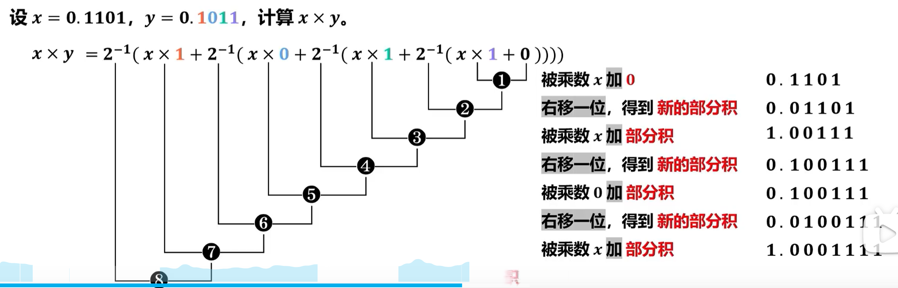

# 1.用户透明问题
## 🏢 1. 核心物理概念对账（名词洗白）

在看具体硬件之前，必须先厘清题目里各种“人设”的微观含义：

1. **高级语言程序员（应用程序员）**：日常写 C/C++/Java 的人。他们**只能看到变量名、函数名**，根本看不到任何底层硬件（==寄存器、内存物理地址对他们全部不可见==）。
    
2. **汇编语言程序员 / 机器语言程序员（简称“程序员”）**：在计组和 408 题干里，**如果只说“程序员”或“用户”，默认指的就是“汇编程序员”**！因为只有到了汇编这一层，才开始讨论硬件的可见性。
    
3. **系统程序员**：负责写操作系统内核、驱动程序、编译器的人。他们的权限最高，能看到普通汇编程序员看不到的“特权控制寄存器”。
    
4. **透明（Transparency）**：**高级高危红线！计算机里的“透明” $=$ 隐瞒 / 程序员不需要关心 / 无法用指令控制。**
    
    - 比如：“Cache 对汇编程序员是透明的”，意思就是汇编程序员**看不见、也无法用指令去读写 Cache**，Cache 完全由硬件自动调度。
        

## 📊 2. 408 统考：硬件/软件对象“可见性”终极对账大表

这是整个计组里最核心的账本，考场上的定性选择题直接对着这张表秒杀：

| **硬件 / 软件对象**                                          | **汇编/机器语言程序员(常称“程序员/用户”)** | **系统程序员(写OS内核/驱动)** | **物理本质与考场考点**                                             |
| ------------------------------------------------------ | -------------------------- | ------------------- | --------------------------------------------------------- |
| **通用寄存器**<br><br>  <br><br>(如 `EAX`, `R1` 等)           | **可见**                     | **可见**              | 汇编语言里必须天天写 `MOV EAX, 5`，必须能用指令直接读写。                       |
| **程序状态字寄存器 (PSW)**<br><br>  <br><br>/ 标志寄存器            | **可见**                     | **可见**              | 存状态标志位（如条件跳转 `JZ` 就要看零标志位 ZF），必须可见。                       |
| **程序计数器 (PC)**                                         | **可见**                     | **可见**              | 虽然不能直接 `MOV PC, 100`，但可以通过调用跳转指令（如 `JMP`）间接修改它的值，算**可见**。 |
| **基址寄存器**                                              | **可见**                     | **可见**              | 汇编人员在做“基址寻址”时，需要在指令中明确指定某个基址寄存器，因此**可见**。                 |
| **暂存寄存器**                                              | ❌ **不可见 (透明)**             | ❌ **不可见 (透明)**      | 位于 CPU 内部、用来临时锁存中间数据的格子（比如ALU输入端），纯硬件控制，任何人无法用指令读写。       |
| **指令寄存器 (IR)**                                         | ❌ **不可见 (透明)**             | ❌ **不可见 (透明)**      | 存放当前正在执行的指令，CPU 硬件自动把指令从内存捞进 IR，程序员无法插手。                  |
| **存储器地址寄存器 (MAR)**<br><br>  <br><br>**存储器数据寄存器 (MDR)** | ❌ **不可见 (透明)**             | ❌ **不可见 (透明)**      | 紧贴着内存总线的 CPU 内部影子寄存器，由 CPU 硬件在访存时自动控制。                    |
| **控制寄存器**<br><br>  <br><br>(如 CR0~CR4、中断屏蔽字)           | ❌ **不可见 (透明)**             | **可见**              | 涉及底层特权、修改 CPU 运行模式、管理中断的寄存器。**普通用户禁止访问，只有系统程序员（OS内核）可见。** |
| **Cache (高速缓存)**                                       | ❌ **不可见 (透明)**             | ❌ **不可见 (透明)**      | 纯硬件电路控制（硬件自动判断是命中还是缺失），**对所有程序员透明**。                      |
| **虚拟存储器 (页表/段表)**                                      | ❌ **不可见 (透明)**             | **可见**              | 普通汇编程序只能看到“逻辑地址”。页表和段表的建立、修改，完全由**操作系统（系统程序员）**通过特权指令维护。  |
| **微程序控制器中的核心**<br><br>  <br><br>(如 CMAR, CMDR, 控制存储器)  | ❌ **不可见 (透明)**             | ❌ **不可见 (透明)**      | 这是 CPU 内部微指令层面的东西（连机器指令都在它上一层），属于硬件实现细节，全透明。              |

## 🏎️ 3. 考场避坑绝招：如何一秒判断“可不可见”？

如果你在考场上遇到了一个表里没有的生僻硬件，或者脑子突然卡壳了，直接用下面这两条**大管家逻辑判定红线**去套：

- **红线一（判可见）**：**如果这个东西，你能用某条汇编指令去读取它、或者改变它，那它就是“可见”的！**
    
    - _例子_：PC（程序计数器）虽然不能直接赋值，但执行 `JMP 0x4000` 时，PC 确实被改成了 `0x4000`，所以 **PC 可见**。
        
- **红线二（判不可见/透明）**：**如果不论你怎么写汇编指令，系统运行该怎么走还是怎么走，这个硬件在背后默默做功，那你用指令根本碰不到它，它就是“不可见（透明）”的！**
    
    - _例子_：不管你汇编怎么写，你都无法下一条指令叫 `MOV Cache, 1`。数据进不进 Cache 纯看硬件电路的脸色，所以 **Cache 程序员不可见（对程序员透明）**。
        

## 📝 408 考前清账定海神针

> **1. 计组里说“透明”就是“看不见、管不着、不需要关心”。**
> 
> **2. 凡是纯硬件自动干活的（Cache、IR、MAR、MDR、暂存寄存器、微程序控制），所有人均不可见。**
> 
> **3. 凡是汇编指令里能指名道姓调用的（通用寄存器、PC、PSW、基址寄存器），汇编程序员均可见。**
> 
> **4. 涉及操作系统内核特权的（虚拟存储器、控制寄存器、中断屏蔽字），仅系统程序员可见，普通用户不可见。**


# 2.三个字长区别
## 🏢 1. 核心解剖：三大字长的物理现场与定义

### 📦 存储字长 —— “主存格子的宽度”

- **物理定义**：**主存储器（内存）中，一个存储单元所包含的二进制代码的位数。**
    
- **物理现场**：你可以把内存想象成一栋由无数个抽屉（存储单元）组成的大楼。每个抽屉拉开，里面固定能塞进去多少个二进制的 `0` 或 `1`，这个数量就是**存储字长**。
    
- **考场潜规则**：现在绝大多数计算机都是“按字节寻址”的，但如果题目明确说“按字寻址”，那么这个“字”的位数就是指存储字长（常见的有 8 位、16 位、32 位等）。
    

### 🏎️ ==机器字长== —— “CPU 运算器的宽度”

- **物理定义**：**计算机 CPU 内部进行一次（定点）整数运算所能处理的二进制数据的位数。**
    
- **物理现场**：机器字长直接反映了 **==CPU 内部 ALU（算术逻辑单元）的宽度** 和 **通用寄存器的位数**==。比如我们常说的“64位处理器”，指的就是机器字长是 64 位，意味着 CPU 一锅端最宽能直接算 64 位的数字加减法。
    
- **物理表现**：机器字长越长，CPU 的计算精度就越高，运算速度就越快。
    

### 📜 指令字长 —— “一整条机器指令的长度”

- **物理定义**：**一条机器指令所包含的二进制代码的总位数。**
    
- **物理现场**：一条指令里要包含操作码（干什么）和地址码（对谁干）。把这些码拼在一起的总长度，就是**指令字长**。
    
- **物理表现**：为了方便大管家从内存里捞指令，指令字长通常设计为 **8 位的整数倍**。
    
    - 如果指令字长 $=$ 机器字长，叫**单字长指令**。
        
    - 如果指令字长 $=$ 机器字长的一半，叫**半字长指令**。
        
    - 如果指令字长 $=$ 机器字长的两倍，叫**双字长指令**。
        

## 📊 2. 降维打击：三大字长的终极对账表

为了让你在考场上面对它们的关系时能够秒杀，请死死焊牢这张对账表：

| **字长维度** | **存储字长 (Storage)**                       | **机器字长 (Machine)**                              | **指令字长 (Instruction)**                      |
| -------- | ---------------------------------------- | ----------------------------------------------- | ------------------------------------------- |
| **决定对象** | **主存芯片的物理结构**<br><br>  <br><br>(存储矩阵的列宽) | **CPU 内部的硬件设计**<br><br>  <br><br>(ALU 和通用寄存器位数) | **指令系统的格式设计**<br><br>  <br><br>(操作码+地址码的规模) |
| **核心含义** | 访存一次，**最多能捞出多少位数据**                      | CPU 动手一次，**最多能算多少位数据**                          | 一条完整的命令，**到底占了多少位**                         |
| **可变性**  | **绝对固定**<br><br>  <br><br>(硬件出厂就焊死了)     | **绝对固定**<br><br>  <br><br>(CPU 芯片设计好就无法更改)      | **可以可变**<br><br>  <br><br>(有定长指令字，也有可变长指令字) |

## 🏎️ 3. 考场大题合账：它们是如何联合折腾 CPU 的？

在 408 计组的指令系统或者 CPU 大题中，出题人非常喜欢把这三个字长揉在一起，考查你 **“CPU 取一条指令要访问几次内存”**。

> **【硬核实战对账】**：假设某老式机器的 **机器字长为 32 位**，**存储字长为 16 位**。现在有一条 **双字长指令**。请问 CPU 完整执行完这条指令的取指阶段，需要访问几次内存？

我们拉开流水线在草稿纸上列账：

1. **盘点指令字长**：题目说它是“双字长指令”，意思就是指令字长是机器字长的两倍。机器字长是 32 位，所以 **指令字长 $= 32 \times 2 = 64$ 位**。
    
2. **盘点单次访存能力**：存储字长是 16 位，意味着 CPU 伸一次手去内存抽屉里捞货物，**最多只能捞出来 16 位**。
    
3. **计算取指访存次数**：这条指令全长 64 位，CPU 每次只能捞 16 位。
    
    $$\text{访存次数} = 64 \div 16 = \mathbf{4}\text{ 次}$$
    
    也就是说，CPU 必须连续发出 4 次访存命令，通过 MDR（存储器数据寄存器）拼凑 4 次，才能把这一条完整的指令装进 IR（指令寄存器）里！
    


# 3.CPI
**CPI 与时钟频率无关！**

如果用一句话切中它的物理本质：**CPI（每条指令需要的时钟周期数）纯粹是一个关于“指令在 CPU 内部需要经历多少个物理步骤”的【结构与逻辑属性】；而时钟频率（主频）是一个关于“电信号振荡有多快”的【工艺与时间速度属性】。两者在物理层面上是相互独立的。**

为了让你在做计算机性能分析的综合大题时能稳稳拿满分，咱们直接拉开 CPU 的微观时空账本，把这两者的本质彻底对一次账：

## 🏗️ 1. 物理现场：CPI 到底由谁决定？

**CPI（Cycles Per Instruction）** 的意思是：平均执行一条机器指令，需要消耗多少个**时钟周期（Clock Cycle）**。

我们之前盘过，一条指令在冯·诺依曼机里要经历：**取指 $\rightarrow$ 译码 $\rightarrow$ 执行**。

- 如果 CPU 采用的是最简陋的**单周期设计**：不管指令多复杂，强制规定都在 1 个时钟周期内干完，那么它的 **CPI 恒等于 1**。
    
- 如果 CPU 采用的是**多周期设计**：简单的加法指令需要 3 个周期，复杂的乘法指令需要 5 个周期。那平均下来，它的 **CPI 可能就是 4**。
    
- 如果 CPU 采用的是现代高大上的**多发射流水线设计**：每个周期能同时吐出好几条指令，它的 **CPI 甚至可以小于 1**。
    

看到了吗？**CPI 的大小，完全取决于 CPU 内部的“硬件架构设计（单周期/多周期/流水线）”、“指令集的复杂程度（CISC还是RISC）”以及“编译器的优化代码质量”**。它是一个纯粹的硬件结构和逻辑数数问题。

## 🏎️ 2. 时钟频率（主频）的微观世界：它又管什么？

**时钟频率（$f$，如 $3.0\text{ GHz}$）** 的物理本质是：CPU 内部的晶振源每秒钟能发出多少次脉冲。

时钟频率的倒数就是**时钟周期（$T = 1/f$）**，即 CPU 内部最小的物理时间颗粒度（比如 1 个周期是 $0.33\text{ 纳秒}$）。

- **主频高意味着什么？**
    
    意味着 CPU 内部的电信号“步伐迈得极其频繁，频率极快”。原本 1 秒钟只能迈 1 亿步，超频之后 1 秒钟能迈 3 亿步。
    
- **但它改变不了步数**：
    
    当你把一辆车的引擎转速调高（提高时钟频率），车子轮子转得更快了（时钟周期变短了）。但是，**从 A 点到 B 点需要轮子转多少圈（一条指令需要多少个周期，即 CPI），是绝对不会改变的！**
    

## ⚠️ 3. 408 考场大题公式合账（避坑红线）

出题人非常喜欢把 **CPI、时钟频率（主频 $f$ 或周期 $T$）** 揉在一起让你算 **CPU 执行时间（CPU Time）**。这个考研必背的核心公式完美展现了它们各司其职的关系：

$$\text{【 CPU 执行时间 】} = \text{指令条数 } (N) \times \mathbf{CPI} \times \text{时钟周期 } (T) = \frac{\text{指令条数 } (N) \times \mathbf{CPI}}{\text{时钟频率 } (f)}$$

### 💡 考场清账对比：

- 如果厂家通过工艺改良，把处理器的时钟频率 $f$ **提升了 2 倍**（时钟周期 $T$ 缩短一半）。
    
- 在这个公式里，指令条数 $N$ 没变，**CPI 也依然雷打不动**。
    
- **最终结果**：CPU 执行时间直接缩短了一半，电脑变快了。
    

这完美证明了：**你可以通过拉高时钟频率来缩短单次执行时间，但你无法通过改变频率去改变一条指令天生需要耗费的周期数（CPI）。**

## 📝 408 考前一秒清账心法

> **CPI 管的是“干完活需要迈多少步”（由硬件架构和指令格式定死）；时钟频率管的是“一秒钟能迈多少步”（由芯片制造工艺和晶振决定）。步数（CPI）与迈步的速度（频率）在定性分析中毫无物理因果关系。所以，CPI 与时钟频率无关，斩钉截铁判【正确】！**


# 4.原码 表示范围


正数（符号位为 `0`）的转换没有任何花样：它的原码 = 补码 = 反码。

## 🏎️ 2. 负数的三码（原、反、补）大对账

当符号位为 **`1`**（负数）时，原码、反码、补码之间的转换就像一条单向或双向的流水线：

```
                 ┌──────────────────────────────────────┐
                 │                取反加 1               │
                 ▼                                      │
  【 原码 】 ──────────► 【 反码 】 ──────────► 【 补码 】
   1.xxxx               符号位不变                符号位不变
                        数值位按位取反            反码末位加 1
```


## 📐 3. 终极考点：四大码制的表示范围与“0”的灾难

这是 408 考研最喜欢挖坑的地方。假设我们手头有 **$n+1$ 位** 机器字长（1 位符号位，$n$ 位数值位），通常以 **8 位（$n=7$）** 为最经典的考场模型：

| **码制** | **n+1 位机器字长的表示范围 (公式)**         | **8 位机器字长的实际范围 (n=7)**    | **“0” 的物理长相 (灾难现场)**                                                                                               |
| ------ | ------------------------------- | ------------------------- | ------------------------------------------------------------------------------------------------------------------ |
| **原码** | $-(2^n - 1) \sim +(2^n - 1)$    | $-127 \sim +127$          | **不唯一**：<br><br>  <br><br>$+0 \rightarrow \mathbf{0},0000000$<br><br>  <br><br>$-0 \rightarrow \mathbf{1},0000000$ |
| **反码** | $-(2^n - 1) \sim +(2^n - 1)$    | $-127 \sim +127$          | **不唯一**：<br><br>  <br><br>$+0 \rightarrow \mathbf{0},0000000$<br><br>  <br><br>$-0 \rightarrow \mathbf{1},1111111$ |
| **补码** | $\mathbf{-2^n} \sim +(2^n - 1)$ | $\mathbf{-128} \sim +127$ | **唯一**：<br><br>  <br><br>$00000000$ (无正负之分)                                                                        |
| **移码** | $\mathbf{-2^n} \sim +(2^n - 1)$ | $\mathbf{-128} \sim +127$ | **唯一**：<br><br>  <br><br>$10000000$                                                                                |

**移码符号位怎么算？补码符号位直接取反！** **移码的判别红线：1 变正，0 变负。字面越大的二进制，其物理真值就一定越大，专为硬件无脑比较大小而生。**

如果按传统的**补码**来看大小：

- $-5$ 的补码是 `11111011`
    
- $+5$ 的补码是 `00000101`
    
- **硬件的痛苦**：如果单纯按二进制的字面大小去比，`11111011` 看起来比 `00000101` 大得多！但物理本质上 $-5 < +5$。所以硬件电路在比较补码大小时，必须单独设计复杂的逻辑去先看符号位，再看数值位，非常麻烦。
    

如果换成**移码**来看大小：

- $-5$ 的移码是 **`01111111`**
    
- $+5$ 的移码是 **`10000101`**
    
- **降维打击**：你看！改完符号位后，$+5$ 的移码 `10000101` 的字面大小，**天生就比** $-5$ 的移码 `01111111` 大！


# 5.进借位标志CF
在纯硬件的数字电路中，**CF（进位/借位标志）** 是通过一个非常经典的**异或门（XOR）** 电路死死焊牢的。

你提到的硬件核心公式是完全正确的：


$$\text{CF} = \text{Sub} \oplus C_{\text{out}}$$

其中两个输入的物理含义为：

1. **$\text{Sub}$ 信号（减法控制控制线）**：当 CPU 执行加法时，$\text{Sub} = 0$；当执行减法时，$\text{Sub} = 1$。
2. **$C_{\text{out}}$（全加器最高位进位输出）**：不管加法还是减法，在物理上都经过同一个全加器，其最高位（MSB）向外的物理进位导线就是 $C_{\text{out}}$（有进位为 1，无进位为 0）。

根据这个异或逻辑，我们把硬件的 **4 种物理状态**、**最终算出的 CF 值** 以及它们在无符号数世界中的**数值意义**全部摊开、一次性彻底清账：

---

### 🟢 状态 1：执行【加法】，最高位【无】进位输出

* **硬件输入**：$\text{Sub} = 0$（加法），$C_{\text{out}} = 0$（全加器没冒出 1）。
* **硬件计算**：$\text{CF} = 0 \oplus 0 = \mathbf{0}$
* **数值表示意思**：**加法结果安全**。两个无符号数相加后，结果没有超出当前字长的最大表示范围。CPU 内部寄存器存下的数据是完全正确的真值。

### 🟢 状态 2：执行【加法】，最高位【有】进位输出

* **硬件输入**：$\text{Sub} = 0$（加法），$C_{\text{out}} = 1$（全加器物理往外冒出了一个 1）。
* **硬件计算**：$\text{CF} = 0 \oplus 1 = \mathbf{1}$
* **数值表示意思**：**加法发生溢出**。两个无符号数相加之和太大了，超出了字长边界。那个冒出来的 $C_{\text{out}}=1$ 相当于丢失了的高位权值（例如 3 位机器里丢失了 $2^3=8$），留在格子里的结果是**错误**的。

### 🔴 状态 3：执行【减法】，大数减小数（够减），全加器【有】进位输出

* **硬件输入**：$\text{Sub} = 1$（减法），$C_{\text{out}} = 1$（由于大减小，执行 $A + \bar{B} + 1$ 时，全加器最高位必然会物理冒出 1）。
* **硬件计算**：$\text{CF} = 1 \oplus 1 = \mathbf{0}$
* **数值表示意思**：**减法成功，没有借位**。被减数大于或等于减数，结果是一个正数或零。这个正数完美落在无符号数的合法领地里，运算结果是**正确**的。

### 🔴 状态 4：执行【减法】，小数减大数（不够减），全加器【无】进位输出

* **硬件输入**：$\text{Sub} = 1$（减法），$C_{\text{out}} = 0$（因为不够减，执行 $A + \bar{B} + 1$ 拼凑不够基数，全加器最高位出不来 1）。
* **硬件计算**：$\text{CF} = 1 \oplus 0 = \mathbf{1}$
* **数值表示意思**：**减法失败，发生了借位（跌破下限溢出）**。小数减大数导致结果变成了负数，但无符号数的世界里没有负数。硬件格子最后存下的是一个“在模的钟表盘上转过头”的错误正数，**意味着发生了借位溢出**。

## 🏗️ 举例：用十进制“钟表盘”看清魔术本质

假设我们有一个只有 **3位数的十进制计算器**，它能表示的范围是 `000 ~ 999`。如果它加到 1000，最高位就会丢掉，重新变成 `000`（也就是**模是 1000**）。

在计算机内部，**“按位取反再加1”** 相当于用模去减那个数。

在 3 位十进制里，减数 $B$ 的“补数”就是 $1000 - B$。

现在我们要算减法 $A - B$，硬件会把它强行转成加法：

$$\text{电路实际算的是：} A + (1000 - B) = \mathbf{1000} + (A - B)$$

看仔细这个算式右边的 **$\mathbf{1000}$**！这相当于我们在加法里**强行向天借了一个 1000**。

### 🟢 【状态三：大减小（够减）】

假设 $A = 500$，$B = 200$（大减小，够减）。

- 电路实际在算：$500 + (1000 - 200) = 500 + 800 = \mathbf{1}300$。
    
- **物理事实**：看到了吗？结果是 1300！最左边那个 **`1`** 啪叽一下冒出来了！这个冒出来的 `1` 就是 **$C_{\text{out}} = 1$**。
    
- **为什么一定会冒出来？** 因为 $A \ge B$，所以 $(A - B)$ 是个正数或0，那么 $\mathbf{1000} + (A - B)$ 结果**必然大于等于 1000**。既然大于等于 1000，最高位就**注定会往外冒出一个进位 `1`**！
    

### 🔴 【状态四：小减大（不够减）】

假设 $A = 200$，$B = 500$（小减大，不够减）。

- 电路实际在算：$200 + (1000 - 500) = 200 + 500 = \mathbf{0}700$。
    
- **物理事实**：看到了吗？结果只有 700！最左边是个 **`0`**，根本没有冒出 `1`！也就是 **$C_{\text{out}} = 0$**。
    
- **为什么一定出不来？** 因为 $A < B$，所以 $(A - B)$ 是个负数，那么 $\mathbf{1000} + (A - B)$ 结果**必然小于 1000**。既然连 1000 都凑不够，最高位就**绝对不可能冒出进位 `1`**！


# 6.并行进位加法器

在计算机组成原理中，并行进位加法器（又称超前进位加法器，Carry Lookahead Adder, CLA）为了解决串行进位（行波进位）里进位信号“像波浪一样一层层慢吞吞传递”的痛点，选择用纯硬件逻辑电路，**直接把每一位的进位 $C_i$ 提前“硬算”出来**。

如果用一句话切中它的物理本质：**任何一位的进位 $C_i$，要么是因为这一位自己“主动产生”了进位，要么是因为前一位有进位传过来、且这一位“刚好愿意帮它传递”。**

为了让你在考场上能够精准推导不记错，咱们直接拉开并行进位的两个核心基础信号，把进位的通用递推公式彻底对齐焊死：
![[Pasted image 20260718222758.png]]

## 🏗️ 1. 核心前置：两个最关键的物理信号

在推导进位公式之前，每一位数字（第 $i$ 位，$A_i$ 和 $B_i$）都会先通过最简单的门电路，算出两个不依赖任何进位的专属哨兵信号：

- **$G_i$（进位产生信号，Generate）**：
    
    $$G_i = A_i \cdot B_i$$
    
    - **物理含义**：只要第 $i$ 位的 $A_i$ 和 $B_i$ 都是 `1`，两个 `1` 相加，**这一位不管低位有没有进位送过来，自己就铁定能产生一个进位**往高位送（与门通电）。
        
- **$P_i$（进位传递信号，Propagate）**：
    
    $$P_i = A_i \oplus B_i \quad (\text{部分芯片为了硬件省料也会设计为 } A_i + B_i)$$
    
    - **物理含义**：只要 $A_i$ 和 $B_i$ 有一个是 `1`，如果此时低位好心送过来一个进位，这一位就能**顺水推舟，把这个低位进位继续向更高位传过去**（异或门通电）。
        

## 🏎️ 2. 核心大考点：前 4 位进位 $C_i$ 的纯硬件递推公式

利用 $G_i$ 和 $P_i$，我们可以不依赖任何中间进位结果，直接用最底层的初始进位 **$C_0$** 展开成纯粹的并行组合逻辑。

在“从 1 开始编号”的物理世界中，4位超前进位芯片内部的 4 个硬核进位公式详细拆解如下：

### 🟢 $C_1$（第 1 位数算完后，向第 2 位送的进位）

$$C_1 = G_1 + P_1C_0$$

- **数值表示意思**：第 1 位自己相加直接产生了进位（$G_1=1$）；或者最原始的初始进位有进位（$C_0=1$），且第 1 位愿意帮你传过去（$P_1=1$）。
    

### 🟢 $C_2$（第 2 位数算完后，向第 3 位送的进位）

$$C_2 = G_2 + P_2G_1 + P_2P_1C_0$$

- **数值表示意思**：第 2 位自己相加直接产生（$G_2=1$）；或者第 1 位产生、第 2 位负责传（$P_2G_1=1$）；或者最原始有进位，第 1 和第 2 位一路绿灯共同传过去（$P_2P_1C_0=1$）。
    

### 🟢 $C_3$（第 3 位数算完后，向第 4 位送的进位）

$$C_3 = G_3 + P_3G_2 + P_3P_2G_1 + P_3P_2P_1C_0$$

- **数值表示意思**：第 3 位自己产生；或者第 2 位产生、第 3 位传；或者第 1 位产生，第 2、3 位一起传；或者初始有进位，1、2、3 三个位置全部同意向下传递。
    

### 🟢 $C_4$（第 4 位数算完后，向更高位送的最终进位输出）

$$C_4 = G_4 + P_4G_3 + P_4P_3G_2 + P_4P_3P_2G_1 + P_4P_3P_2P_1C_0$$

- **数值表示意思**：第 4 位自己产生；或者前面任何一位产生、并由其高位一路绿灯传到尽头；或者最原始的 $C_0$ 在 4 个传递者的护送下直接贯穿全盘。
    

## 📊 3. 为什么并行进位加法器能“狂飙速度”？

我们可以从这套公式的**结构和层次**上，一眼看出并行进位加法器为什么是现代 CPU 算力的心脏：

- **看公式的右边**：仔细观察你会发现，$C_1, C_2, C_3, C_4$ 每一个公式的右边，**只有 $G$、$P$ 信号和最开始的 $C_0$，完全没有中间进位（例如 $C_4$ 的公式里只有 $G$ 和 $P$，根本不需要等 $C_3$ 算出来）**！
    
- **物理实现**：在芯片内部，所有的输入信号 $A_i$ 和 $B_i$ 是同时送达的。这意味着所有的 $G_i$ 和 $P_i$ 只要在第 1 个门延迟时间就能集体算完。接下来的 $C_1 \sim C_4$ 就可以通过一个**多输入的“与或门”电路同时通电，在第 2 个门延迟时间内同步暴风吐出**！
    
- **考场定性结论**：**并行进位加法器的各个高位进位是同时产生的，其进位延迟时间与加法器的位数（字长）完全无关！** 它彻底拔掉了老式串行进位加法器由于“位数越多、电信号传递越慢”的致命毒瘤。
    

## 📝 408 考前手写公式的“无脑排查红线”

采用这种从 1 开始的写公式习惯，你在草稿纸上写完可以用这两条铁律秒杀检查：

1. **首位对齐**：公式右边的第一项，必然是**当前进位下标对应的那个 $G$**（比如算 $C_3$，右边第一项一定是 $G_3$）。
    
2. **尾项抱团**：公式的最后一项，必然是**从当前位一路连续乘到第 1 位的全盘 $P$ 信号，死死抱住最原始的 $C_0$**（比如算 $C_4$，最后一项必为 $P_4P_3P_2P_1C_0$）。
    


# 7.乘除法

https://www.bilibili.com/video/BV1hA4m1w7eS/?spm_id_from=333.337.search-card.all.click&vd_source=a4dacf1d894501be51ca88ca384c9878



# 8.模4补码

模 4 补码**只在运算器（ALU）的内部执行加减法时瞬间产生**

把这两个概念连起来，就是现代 CPU 内部完整的数据流转生命周期：

```
 【存储状态】                       【运算状态】                       【回存状态】
  模 2 补码                         模 4 补码（符号扩展）               模 2 补码
(单符号位, 节省空间)              (进入 ALU 运算核心)               (脱掉高位符号位)
   [ 1 ] 1111011  ─── 通电进入 ───►  [ 1 1 ] 1111011  ─── 存回内存 ───►   [ 1 ] 1111011
```

如果是01  写回1，所以正 正 得负 溢出

1. **静态存储在内存里**：用 **模 2 补码（单符号位）**，老老实实省空间。
    
2. **数据被拿到 ALU 里做加减法**：硬件电路会自动把这单符号位复制一份，强行扩展成 **模 4 补码（双符号位）** 参与运算。
    
3. **运算结束判断溢出**：ALU 瞅一眼双符号位是不是 `01` 或 `10`，判定有没有翻车。
    
4. **结果写回寄存器/内存**：一旦确认安全或处理完溢出，硬件会**啪叽一下把左边多出来的最高符号位直接砍掉（截断）**，重新变回 **模 2 补码（单符号位）** 存回存储器。


# 9.类型转换细节


![[Pasted image 20260719224404.png]]
## 🏗️ 1. 物理现场还原：编译器看这个算式的视角

在 CPU 眼里，这个算式并不是一锅端同时算完的，而是根据**运算符优先级**，拆解成了三大步：

$$\text{第一步：计算 } m/2 \quad \longrightarrow \quad \text{第二步：计算 } a/2 \quad \longrightarrow \quad \text{第三步：把前两步的结果加起来}$$

在这个流水线里，你记住的“先转换、后运算”红线，在**每一步**里都严格执行了，只是每一处的对手不同：

### 🔴 第一步：计算 `m/2` （整数对整数）

- **操作数 1**：`m`，它是 `int` 类型。
    
- **操作数 2**：`2`，它是一个字面量整数，默认也是 `int` 类型。
    
- **类型对齐**：编译器一看，左边是 `int`，右边也是 `int`。**它们的类型本来就是一模一样的！根本不需要做任何类型提升或转换。**
    
- **执行运算**：既然类型已经一致，立马触发 **【整数除法】** 硬件电路。`13 / 2` 吐出结果 **`6`**（也是 `int` 类型）。
    
### 🔵 第二步：计算 `a/2` （浮点对整数）

- **操作数 1**：`a`，它是 `float` 类型。
    
- **操作数 2**：`2`，它是 `int` 类型。
    
- **类型对齐**：编译器一看，这俩类型不一样！**“先转换、后运算”的规则瞬间启动**。`int` 类型的 `2` 被迫符号扩展并提升为 `float` 类型的 `2.0`。
    
- **执行运算**：现在两个操作数都变成了 `float`（`12.6 / 2.0`），触发 **【浮点数除法】** 硬件电路。算完吐出结果 **`6.3`**（也是 `float` 类型）。
    

### 🟡 第三步：把两边的结果加起来（`6 + 6.3`）

这时候，流水线来到了最后的加法：`[第一步的结果 6] + [第二步的结果 6.3]`。

- **左边操作数**：`6`，它是 `int` 类型。
    
- **右边操作数**：`6.3`，它是 `float` 类型。
    
- **类型对齐**：**“先转换、后运算”的规则再次无脑启动**！左边的 `int` 类型的 `6` 被迫进行类型提升，变成了 `float` 类型的 `6.0`。
    
- **执行运算**：两边终于对齐成了同一类型（`6.0 + 6.3`），触发加法，最终合账得出 **`12.3`**。
    

## 🏎️ 2. 怎样才能让它按照你想的那样先转换？

如果你希望 `m/2` 在计算时就先进行类型转换，从而保留 `.5` 的精度，你必须在**第一步的除法发生之前**，强行破坏它们的“门当户对”。

你有两种改法，在考场上非常常见：

- **改法 A（手动强转）**：`x = (float)m / 2 + a / 2;`
    
    - 这样编译器在做左边除法前，一瞅左边是 `float`，右边是 `int`，就会自动把 `2` 提升为 `2.0`，此时 `13.0 / 2.0` 就能算出 `6.5` 了。
        
- **改法 B（直接改字面量）**：==`x = m / 2.0 + a / 2;`==
    
    - 把右边的整数 `2` 换成浮点数 `2.0`。编译器一瞅类型不一致，立马把 `m` 提升为 `13.0`，同样能算出 `6.5`。


