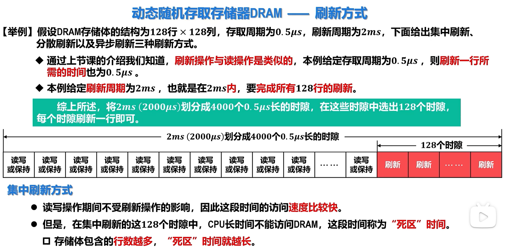
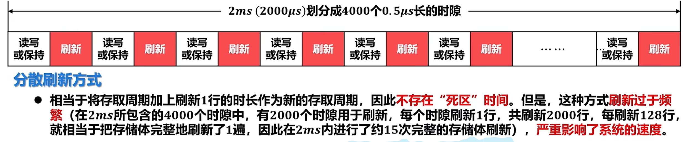
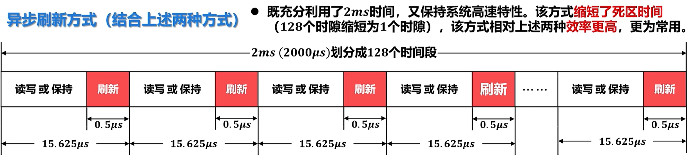
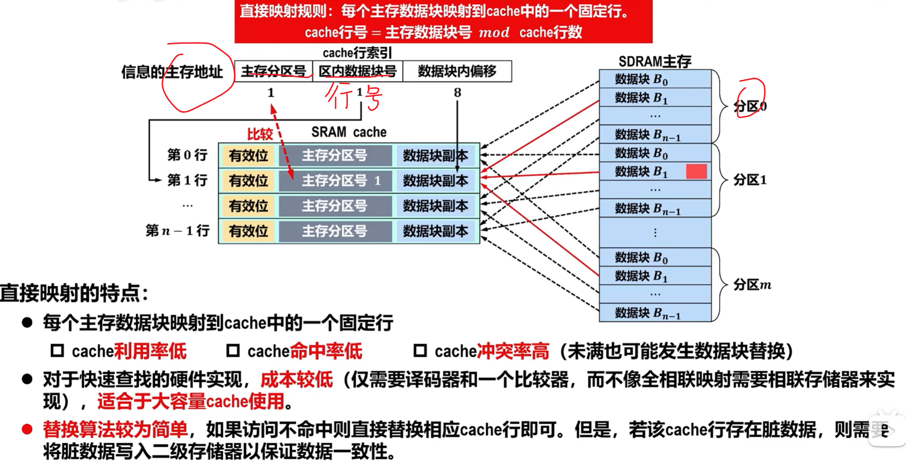
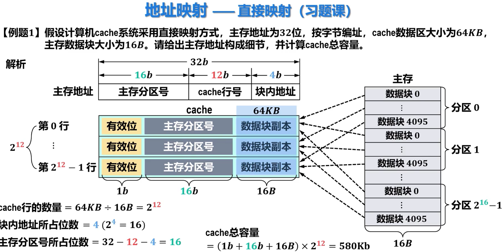
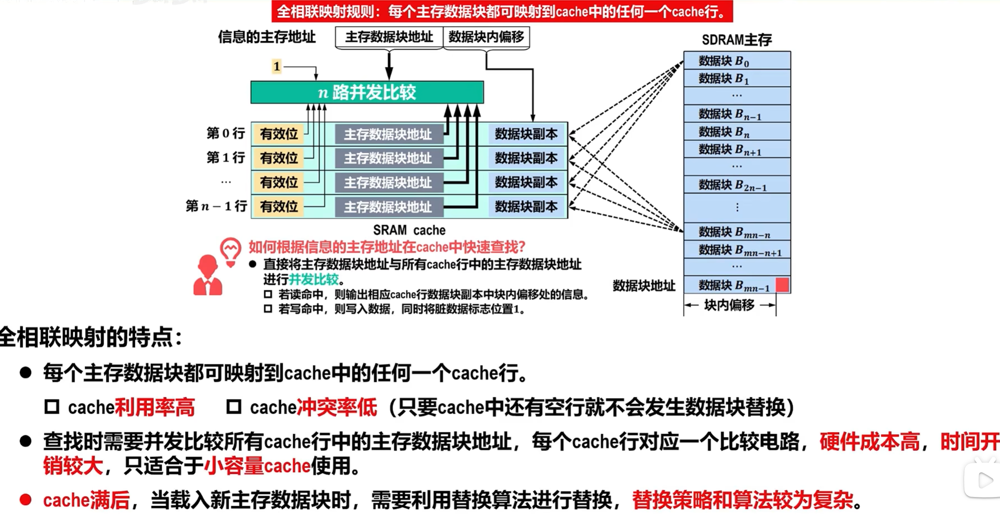
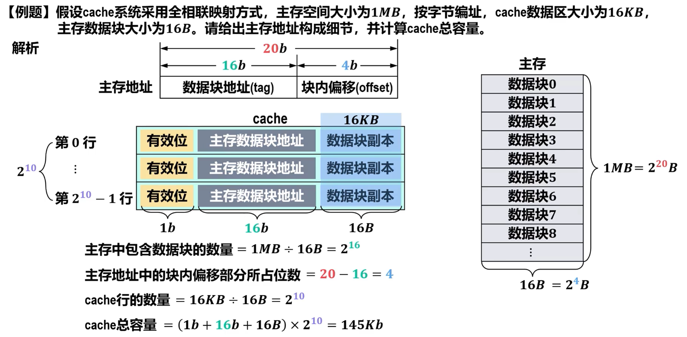
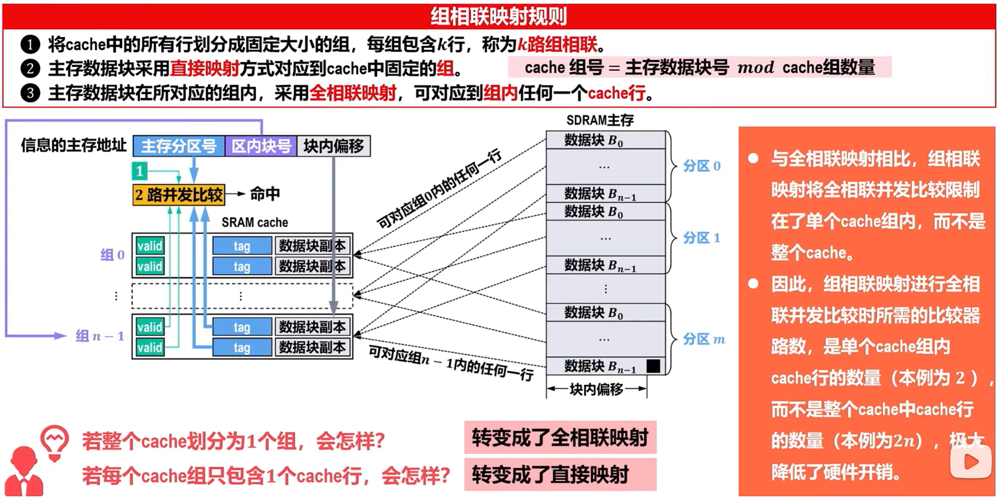
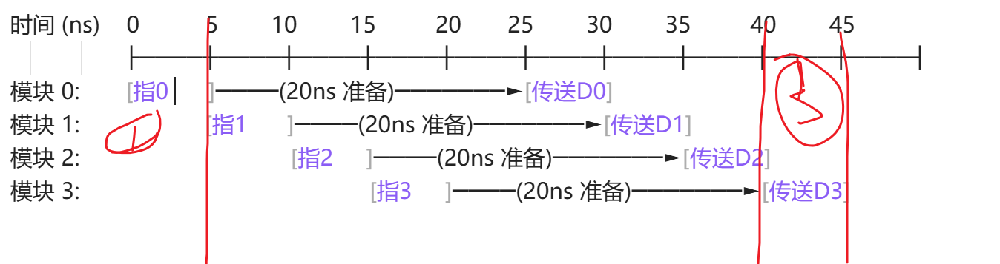
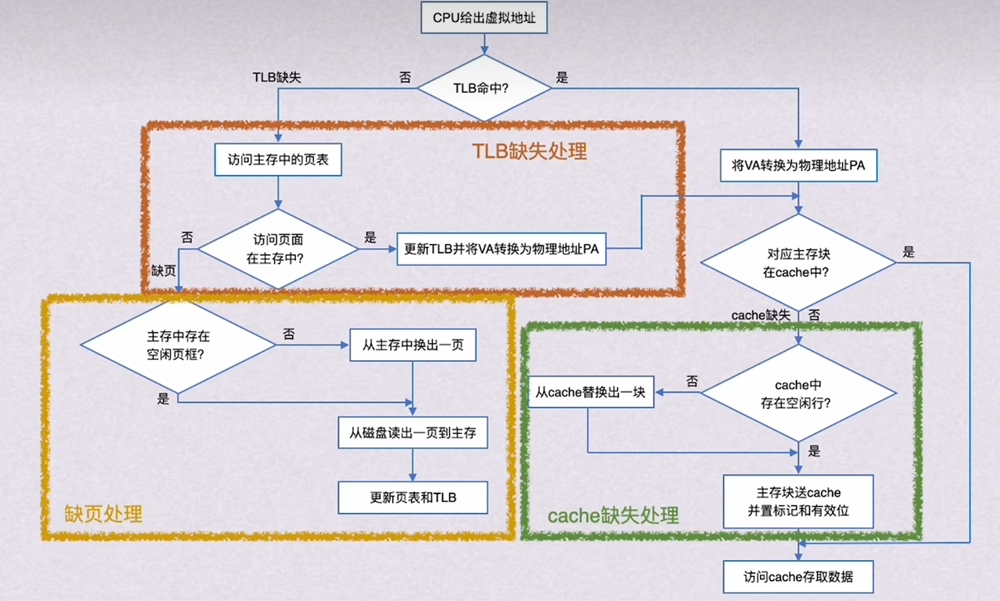

# 1.刷新周期

# 2.cacha映射

“Cache 失败 + 读主存” 只算 1 次访存
在计算命中率的时候  次数也只算一次
或者说命中率只看cache 和 访不防问主存 无关

### 直接映射

### 全相联映射

### 组相联映射

# 3.流水线 周期

时间 (ns)    0          5        10        15         20       25        30        35         40        45
          ├────┼────┼────┼────┼────┼────┼────┼────┼────┼────┤
模块 0:       [指0      ]────(20ns 准备)───────►[传送D0]
模块 1:                   [指1      ]────(20ns 准备)───────►[传送D1]
模块 2:                                [指2     ]────(20ns 准备)───────►[传送D2]
模块 3:                                            [指3     ]────(20ns 准备)───────►[传送D3]

1：传送首地址 和命令
2：流水线准备数据
3：最后一组数据发送
t=T总线（5ns）+T存取（20ns）+（n-1）· T总线  +T总线

# 4.虚拟存储器

